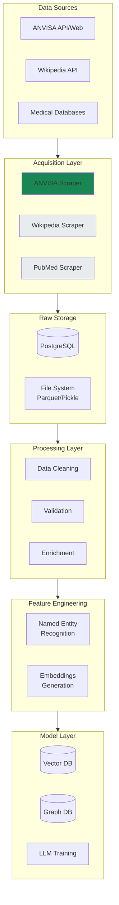
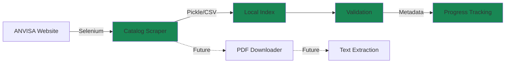
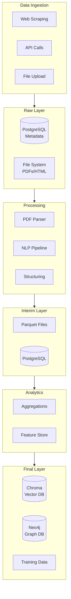
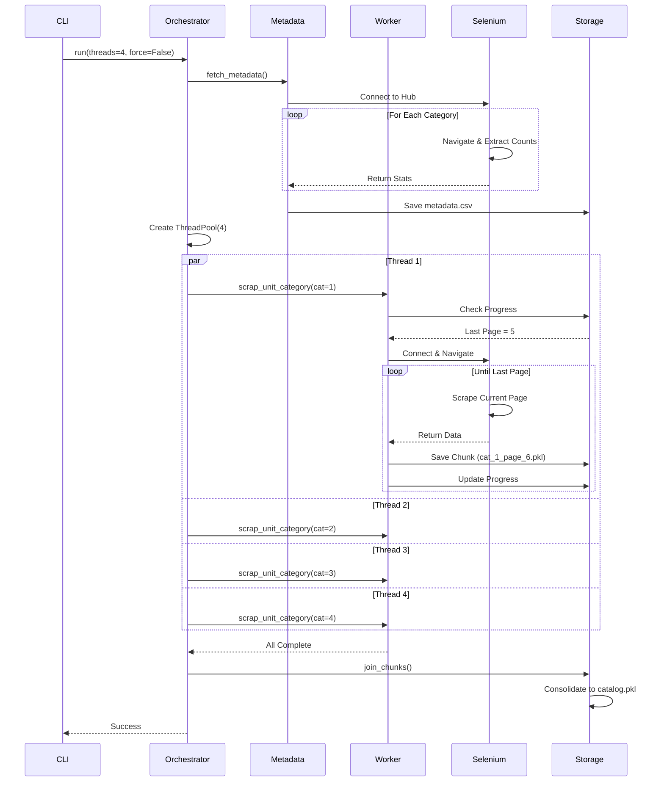
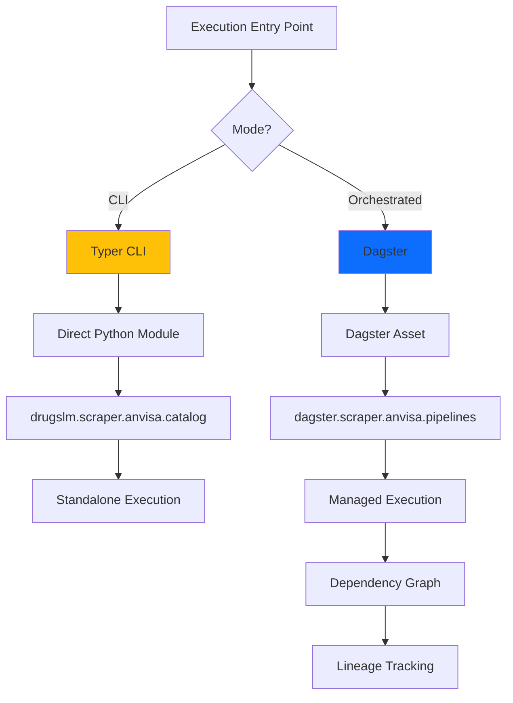
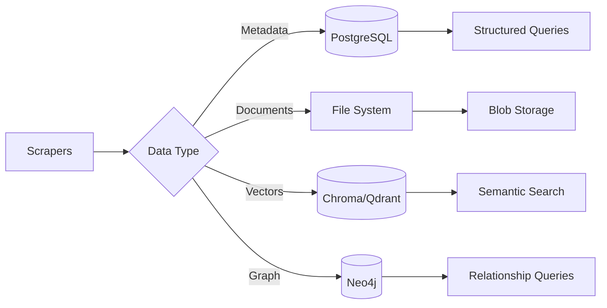
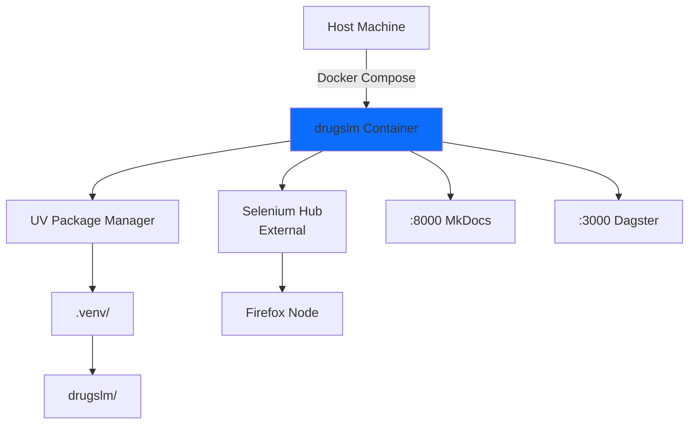

# Architecture

This document describes the technical architecture, design decisions, and data flows of the DrugsLM project.

---

## Table of Contents

- [System Overview](#system-overview)
- [Data Pipeline Architecture](#data-pipeline-architecture)
- [Scraper Design](#scraper-design)
- [Orchestration Strategy](#orchestration-strategy)
- [Storage Layer](#storage-layer)
- [Execution Modes](#execution-modes)
- [Design Decisions](#design-decisions)

---

## System Overview

DrugsLM follows a **modular pipeline architecture** where each stage is independently executable and composable through Dagster orchestration.



**Legend**: 🟢 Implemented | ⚪ Planned

---

## Data Pipeline Architecture

### Current State (MVP)

The project currently focuses on the **data acquisition layer**, specifically the ANVISA scraper module.



### Planned Architecture



---

## Scraper Design

### ANVISA Scraper Architecture

The ANVISA scraper follows a **resilient, resumable, parallel execution** pattern.



### Key Features

1. **Resumability**: Progress is tracked per-category in `scrap_progress.csv`
2. **Fault Tolerance**: Each category runs in isolation; failure doesn't crash others
3. **Checkpointing**: Every page is saved as a chunk (`category_id_page_num.pkl`)
4. **Deduplication**: Final consolidation removes duplicates by `expediente` field
5. **Validation**: Compares local catalog against remote metadata for consistency

---

## Orchestration Strategy

### Dual Execution Model

The project supports two execution paradigms:



#### 1. CLI Mode (Typer)

**Use Case**: Development, testing, ad-hoc execution

```bash
# Standalone execution
uv run python -m drugslm.scraper.anvisa.catalog run --threads 4
```

**Advantages**:
- Fast iteration during development
- Direct control over parameters
- No orchestrator dependency
- Ideal for debugging

#### 2. Dagster Mode (Planned)

**Use Case**: Production pipelines, dependency management, monitoring

```python
# dagster/scraper/anvisa/pipelines.py (planned structure)
from dagster import asset, AssetExecutionContext
from drugslm.scraper.anvisa.catalog import scrap_categories

@asset
def anvisa_catalog(context: AssetExecutionContext) -> pd.DataFrame:
    """Scrapes ANVISA drug catalog with full metadata."""
    scrap_categories(n_threads=4, force=False)
    return get_catalog()

@asset(deps=[anvisa_catalog])
def anvisa_leaflets(context: AssetExecutionContext):
    """Downloads PDFs for all cataloged drugs."""
    # Implementation pending
    pass
```

**Advantages**:
- Automatic dependency resolution
- Built-in retry and alerting
- Data lineage visualization
- Centralized logging

---

## Storage Layer

### File-Based Storage (Current)

```
data/
├── raw/anvisa/index/
│   ├── metadata.csv              # Category stats (fetched from ANVISA)
│   ├── scrap_progress.csv        # Execution checkpoints
│   ├── catalog.pkl               # Consolidated drug catalog
│   ├── catalog.csv               # Human-readable export
│   └── chunks/
│       ├── 1_1.pkl              # Category 1, Page 1
│       ├── 1_2.pkl              # Category 1, Page 2
│       └── ...
```

**Rationale**:
- Pickle for fast I/O with pandas DataFrames
- CSV for human inspection and interoperability
- Chunked storage enables resumability

### Future: Hybrid Storage



---

## Execution Modes

### Development Container



**Key Features**:
- Unified `Dockerfile` with dev/prod stages
- Entrypoint script with file locking for parallel containers
- Auto-activation of venv in `.bashrc`
- Mounted volumes for hot-reload

### Makefile Shortcuts

The `Makefile` provides a unified interface for all common tasks:

```makefile
# Environment
make install      # Install uv toolchain
make dev          # Setup full dev environment
make clean        # Remove Python artifacts

# Services
make dagster up   # Start Dagster (localhost:3000)
make docs up      # Start MkDocs with live reload (localhost:8000)

# Code Quality
make lint         # Ruff check
make format       # Auto-format
make test         # Pytest
```

---

## Design Decisions

### 1. Why UV Instead of Poetry/PDM?

- **Speed**: 10-100x faster dependency resolution
- **PEP 723**: Native support for inline script metadata
- **Zero Config**: Works out-of-box without `pyproject.toml` modifications
- **Lockfile**: `uv.lock` is portable and deterministic

### 2. Why Pickle for Intermediate Storage?

- **Performance**: Faster serialization than JSON/CSV for pandas DataFrames
- **Type Preservation**: Maintains dtypes without schema definitions
- **Simplicity**: No database setup needed for MVP phase
- **Trade-off**: Not human-readable (CSV exports provided for inspection)

### 3. Why ThreadPoolExecutor Instead of Multiprocessing?

- **GIL Release**: Selenium I/O operations release the GIL
- **Simplicity**: Shared memory for progress tracking
- **Resource Efficiency**: Lower overhead than process spawning
- **Sufficient**: Network I/O is the bottleneck, not CPU

### 4. Why Separate `drugslm/` and `dagster/` Directories?

- **Separation of Concerns**: Core logic independent of orchestrator
- **Testability**: Unit test modules without Dagster dependency
- **Flexibility**: CLI execution doesn't require Dagster installation
- **Clarity**: Clear distinction between "what" (drugslm) and "how" (dagster)

### 5. Why Remote Selenium Hub?

- **Parallelism**: Multiple browser instances across workers
- **Resource Isolation**: Browsers run on dedicated infrastructure
- **Flexibility**: Easy to scale horizontally
- **Development**: Local debugging with Docker Selenium

### 6. Why MkDocs Instead of Sphinx?

- **Markdown Native**: Easier for non-Python contributors
- **Material Theme**: Professional appearance out-of-box
- **Live Reload**: Faster iteration during writing
- **Integration**: Built-in API doc generation with `mkdocstrings`

---

## Future Enhancements

### Planned Improvements

1. **Database Integration**
   - PostgreSQL for structured metadata
   - Neo4j for drug-drug interactions graph

2. **Distributed Execution**
   - Dagster cloud deployment
   - Ray for distributed training

3. **Monitoring**
   - Prometheus metrics
   - Grafana dashboards
   - Error tracking (Sentry)

4. **Data Quality**
   - Great Expectations for validation
   - DVC for data versioning

---

**Next**: See [Infrastructure](infrastructure.md) for deployment and hardware specifications.