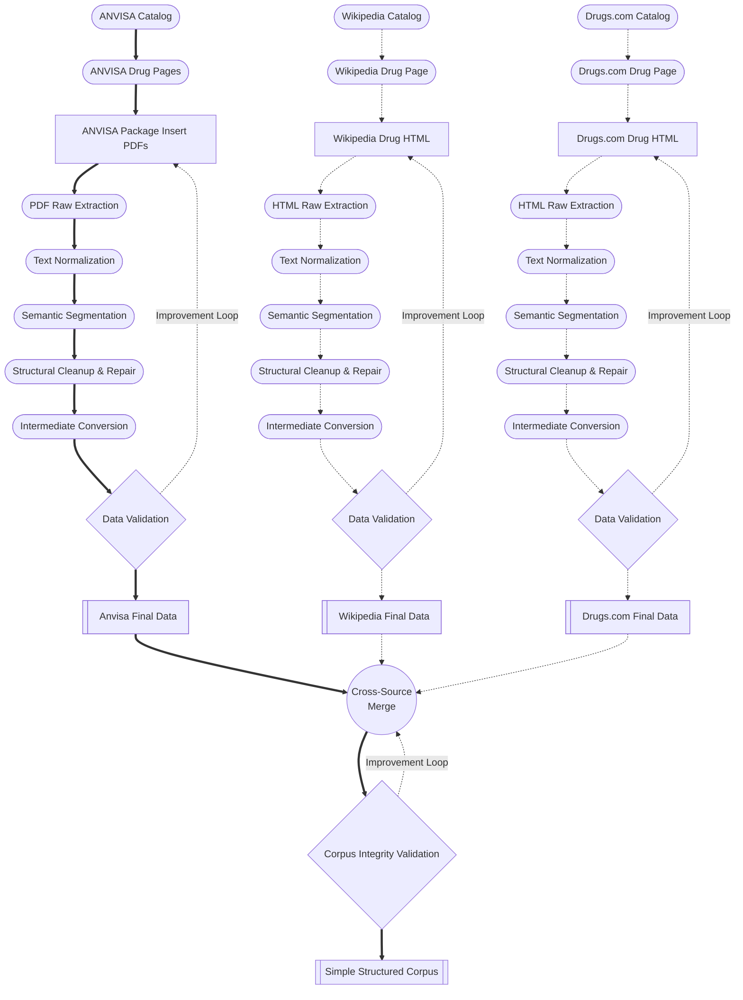

# Experimental Assets Lineage ( Data Roadmap )

The diagram below illustrates the complete data acquisition and processing roadmap for this project, organized as a data-centric asset chart, showing progress across all assets. Each node also has a link to the main module responsible for acquiring the respective data, whether completed or in progress.

## Phase 1 — Data Acquisition and Preparation (ETL)

This phase establishes the empirical foundation of the entire system. Data must be **collected**, **curated**, **cleaned**, **filtered**, **normalized**, and **structured** to support the intended behavior of the model. For large language models, this includes **deduplication**, **domain balancing**, **safety filtering**, and the creation of well-defined **training**, **validation**, and **test splits**. The quality and representativeness of the data directly determine the reliability and limits of the downstream model.

## Phase 2 — Modeling and System Design

With the data prepared, the next step is to design the computational solution. In the context of LLMs, this may involve selecting an existing **pretrained model** or defining an architecture to be trained from scratch. It also includes choosing the adaptation strategy: **retrieval-augmented generation (RAG)**, **parameter-efficient fine-tuning (PEFT/LoRA)**, **full fine-tuning**, or **reinforcement learning from human feedback (RLHF/RLAIF)**. The decisions made here define both the model’s capabilities and its operational constraints.

## Phase 3 — Training and Optimization

During training, model parameters are optimized to approximate the target function. For LLMs, this encompasses **pre-training**, **supervised fine-tuning (SFT)**, and iterative post-training methods such as **RLHF** or **RLAIF**. Optimization involves careful selection of **learning rates**, **batch sizes**, **loss functions**, and **regularization strategies**. Stability, convergence, and computational efficiency are central concerns at this stage.

## Phase 4 — Evaluation and Validation

The model must be evaluated rigorously across quantitative and qualitative dimensions. In traditional ML, this involves metrics such as **accuracy**, **F1 score**, or **perplexity**. For LLMs, the evaluation expands to include **reasoning benchmarks**, **domain-specific test suites**, **human preference assessments**, and **safety analyses**. Robust validation ensures the model not only performs well on held-out data but also behaves consistently and safely in real-world scenarios.

## Phase 5 — Deployment

Deployment operationalizes the model, integrating it into an environment where it can serve users or downstream systems. This includes decisions about **inference infrastructure**, **latency requirements**, **cost constraints**, and **security mechanisms**. For LLM systems, deployment often requires orchestration of additional components such as **vector databases**, **retrieval pipelines**, **guardrails**, and **monitoring agents**.

## Phase 6 — Monitoring and Continuous Improvement

After deployment, the system must be continuously monitored for **performance degradation**, **data drift**, **emergent failure modes**, and **safety violations**. Feedback loops—both automated and human-supervised—inspire iterative updates to the **data**, the **model**, or the **retrieval and alignment components**. This ongoing process is essential for maintaining reliability, especially in domains with evolving knowledge or regulatory requirements.

# tmp

    %% Track Wikipedia
    WikiA[Wiki Categories]:::could
    Wiki[Wiki Categories]:::could
    WikiPage[Wiki Articles]:::could
    WExt[HTML Extraction]:::could
    WProc[Wiki Processor]:::could

    %% Track Drugs.com
    DrugsA[Drugs.com Catalog]:::drop
    Drugs[Drugs.com Catalog]:::drop
    DrugsPage[Drugs.com Pages]:::drop
    DExt[HTML Extraction]:::drop
    DProc[Drugs Processor]:::drop

    %% Convergence Point
    SSC[Simple Structured Corpus]:::must

    WikiA -.-> Wiki -.->WikiPage --> WExt --> WProc --> SSC
    DrugsA -.-> Drugs -.-> DrugsPage -.-> DExt -.-> DProc -.-> SSC