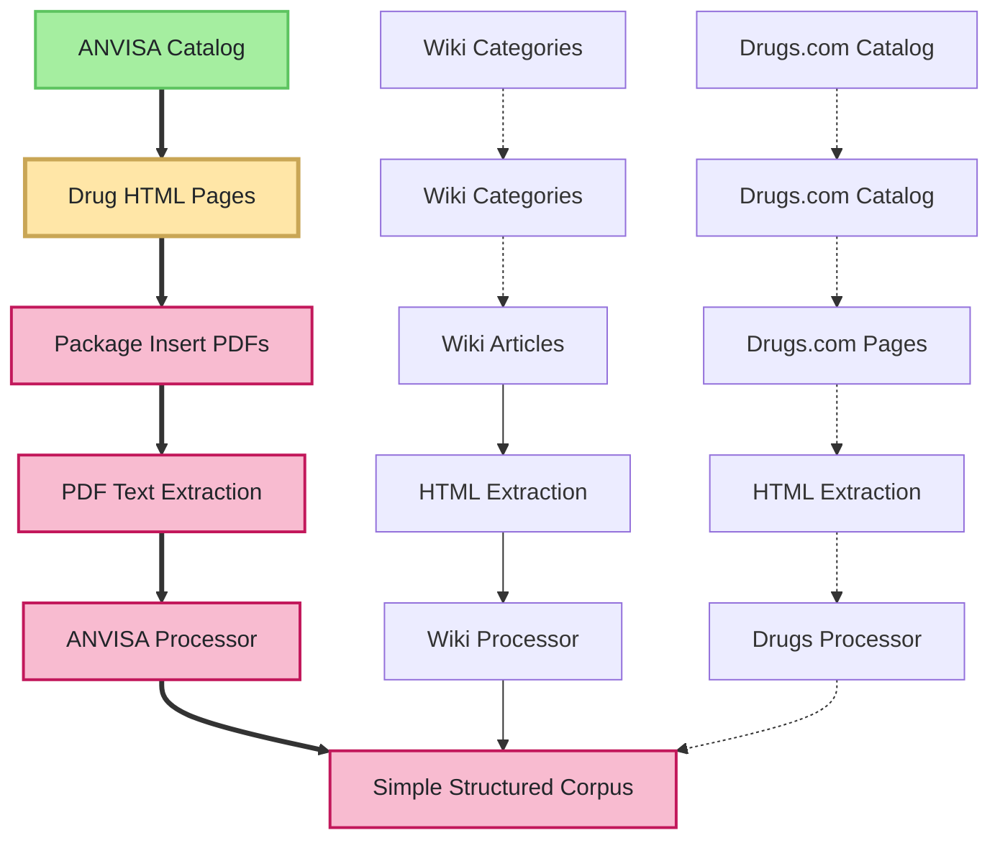
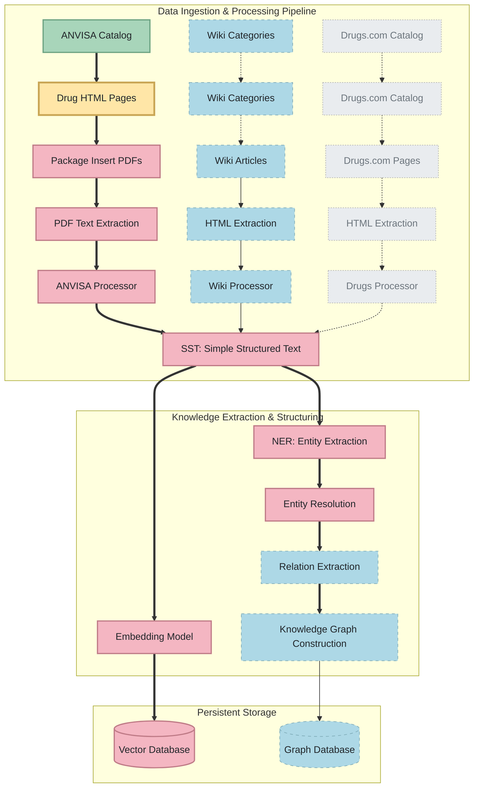

# Experimental Assets Lineage ( Data Roadmap )

The diagram below illustrates the complete data acquisition and processing roadmap for this project, organized as a data-centric asset chart, showing progress across all assets. Each node also has a link to the main module responsible for acquiring the respective data, whether completed or in progress.

## Step 1 - Data Acquisition

Abrange desde a Extração, Processamento e Carregamento dos dados em bancos de dados e em formatos que podem ser utilizados nos próximos passos

---

## Step 2 - Model
## Step 3 - Evaluate

# OLD

