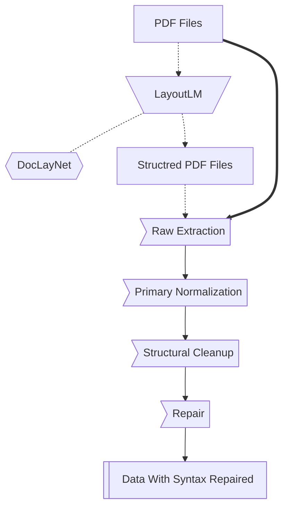
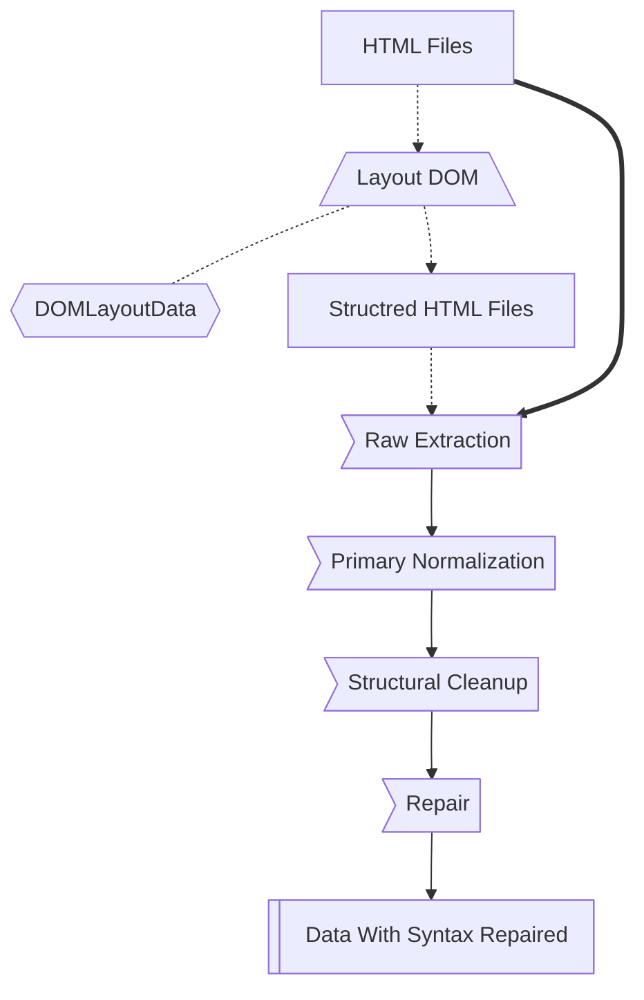
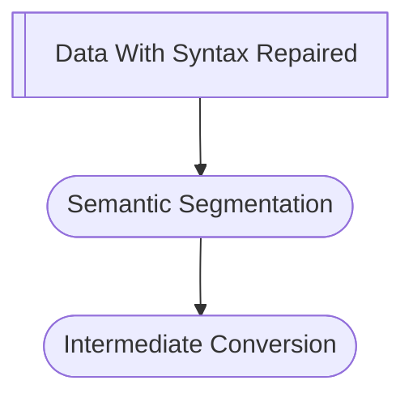

# Phase 1 Internals Diagrams Detailed

To prevent Overview from becoming polluted, data and processes were grouped into modules. Here are the modules related to Phase 1 — Data Acquisition and Preparation (ETL).

> **Note:** If you are looking for completed roadmap, please refer to the [Experimental Assets Lineage](index.md).

## PDF Extraction Diagram

## HTML Extraction Diagram

## Semantic Model Diagram

## Check Data Diagram

## Cross-Source Merge Diagram

## Corpus Integrity Validation Diagram