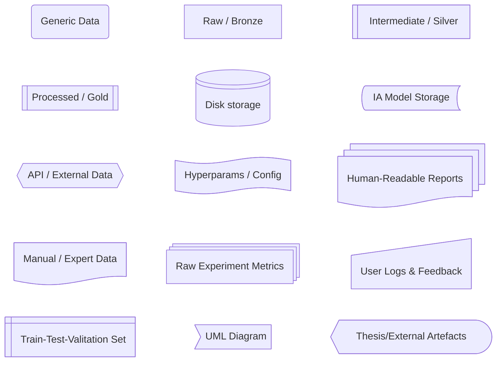
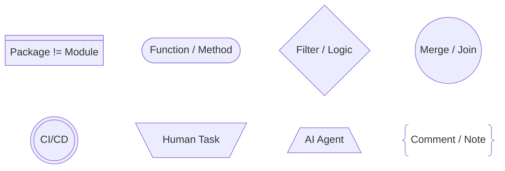
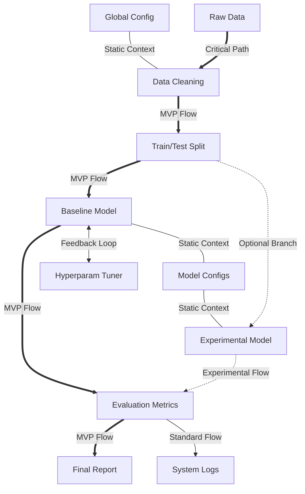

# MermaidJS Flowchart Modeling Standards

The definitions below outline the semantic rules for interaction flows, execution states, and data artifact taxonomy used throughout this documentation.

## Data Artifact Taxonomy

Given the attempt at a data-centric nature of this research, distinguishing between data types and their maturity levels is crucial. We employ a specific shape taxonomy to categorize artifacts, following a modified "Medallion Architecture" (Bronze, Silver, Gold) adapted for LLM pipelines. This taxonomy visually separates raw inputs, intermediate in-memory structures, consolidated corpora, persistent storage, and model weights (both internal and external), ensuring that the state of any data asset is instantly recognizable.

### Table of Data Artifact Taxonomy

> Note: To use custom shapes the New Syntax is `Node@{ shape: shape-name, label: "Text"}`

---

| Shape Name & Usual Meaning | Mermaid Syntax | Project Meaning |
| :--- | :---: | :--- |
| **Rounded Rectangle** Event | `id(Text)` `rounded` | **Generic Data:** Auxiliar, generic, or unclassified data. |
| **Rectangle** Process | `id[Text]` `rect` | **Bronze:** Immutable raw source files (PDFs, HTML dumps). |
| **Lined Rectangle** Lined/Shaded Process | `lin-rect` | **Silver:** Intermediate, transient, or in-memory data (e.g., extracted JSON). |
| **Framed Rectangle** Subprocess | `id[[Text]]` `subproc` | **Gold:** Processed, structured, and consolidated corpus. |
| **Cylinder** Database | `id[(Text)]` `disk` | **Persistent Store:** Indexed Databases (Vector DB, Graph DB). |
| **Bow Tie Rectangle** Stored Data | `stored-data` | **IA Model Storage:** Base models/weights downloaded (e.g., Llama 3.1 Base). |
| **Hexagon** Prepare Conditional | `id{{Text}}` `hex` | **API/External:** External services or data sources accessed via network (e.g., Oracle). |
| **Flag** Paper Tape | `flag` | **Params:** Configuration files, hyperparameters, single text assets. |
| **Stacked Document** Multi-Document | `docs` | **Reports:** Human-readable documents (PDF, Markdown, Latex) generated from experiments. |
| **Document** Document | `doc` | **Manual Entry:** Hand-crafted data, expert QA pairs, or manually inserted datasets (Ground Truth). |
| **Stacked Rectangle** Multi-Process | `processes` | **Metrics:** Raw internal data, metrics, logs, and experiment states (source for reports). |
| **Sloped Rectangle** Manual Input | `manual-input` | **User Data:** Logs, chat history, feedback, and personal info provided by users. |
| **Window Pane** Internal Storage | `win-pane` | **TTV Set:** Train, Validation, and Test splits. |
| **Asymmetric Shape** Odd | `id>Text]` `odd` | **Link/Ref:** Reference to another UML Diagram or Documentation Section. |
| **Curved Trapezoid** Display | `curv-trap` | **External Artefact:** The document generated based on the general roadmap/flowchart. |

## Process Artifact Taxonomy

During the creation of this document, it was noticed that not everything is easily understandable using a data-driven approach. Therefore, this taxonomy defines **process artifacts**: the execution units, orchestration boundaries, and transformation logic used across pipelines. These shapes **represent executing components** (functions, subsystems, auxiliary processes, and external/parallel flows). They do not represent data state.

### Table of Process Artifact Taxonomy

> Note: To use custom shapes the New Syntax is `Node@{ shape: shape-name, label: "Text"}`

---

| Shape Name & Usual Meaning | Mermaid Syntax | Project Meaning |
| :--- | :---: | :--- |
| **Divided Rectangle** Divided Process | `div-rect` | **Module:** A self-contained code package (e.g., `drugslm.scraper`). Represents a "Black Box" system. |
| **Stadium** Terminal Point | `id([Text])` `stadium` | **Function/Method:** A specific logic block, class, or script that is crucial for understanding the flow. |
| **Diamond** Decision | `id{Text}` `diamond` | **Filter / Logic Gate:** Conditional branching OR a "Many-to-One" filter (e.g., discarding invalid data). |
| **Circle** Start | `id((Text))` `circle` | **Merge / Join:** The sophisticated unification of structured data streams. Not just a mix, but a join. |
| **Double Circle** Stop | `id(((T)))` `double-circle` | **CI/CD:** A stable final state or completion of a major process flow and your continuous integration (CI) and continuous delivery (CD). |
| **Trapezoid Top** Manual Operation | `id[\Text/]` `manual` | **Human Task:** Manual annotation, expert validation, creation of protocols, or ground truth sampling. |
| **Trapezoid Bottom** Priority Action | `id[/Text\]` `priority` | **AI Task:** Automated intelligent processing (e.g., LLM-based labeling, synthetic data generation). |
| **Braces** Comment | `braces` | **Annotation:** Contextual notes, explanations, or "nice-to-know" info attached to nodes. |

## Execution Status Lifecycle

To facilitate project tracking and roadmap visualization, a semantic color palette is applied to diagram nodes based on their current development state. This color-coding allows for an immediate assessment of the project's progress, clearly distinguishing between completed assets, currently active tasks, mandatory milestones, and planned future features (backlog), as well as identifying deprecated or aborted approaches.

### Table of Status Lifecycle

---

| Class | Style Preview | Meaning |
| :--- | :--- | :--- |
| `:::done` | Green (Solid) | **Done:** Completed artifacts or processes. |
| `:::active`| Yellow (Bold) | **Active:** Currently work-in-progress. |
| `:::must` | Pink (Solid) | **Must:** Mandatory milestones. High priority. |
| `:::todo` | Blue (Dashed) | **Todo:** Planned future tasks (Backlog). |
| `:::dropped`| **Gray (Faded)**| **Aborted:** Features or paths that were discarded or de-prioritized. |

## Interaction Flows & Dependencies

The edges connecting nodes in our diagrams represent the nature of the relationship and the priority of the data flow. We distinguish between the Critical Path (essential steps for the project's Minimum Viable Product), standard data transformations, and optional or experimental branches. Additionally, specific line styles indicate static dependencies (read-only context) and iterative feedback loops, providing a clear map of how data and control propagate through the system.

### Table of Paths and Flows

---

| Syntax | Line Style | Project Meaning |
| :--- | :--- | :--- |
| `A ===> B` | **Thick Solid** | **Critical Path (MVP):** The core pipeline. Essential steps for thesis completion ("Rice and Beans"). |
| `A --> B` | **Solid Arrow** | **Standard Flow:** Normal data transformation flow or sub-steps within a major process. |
| `A -.-> B` | **Dotted Arrow** | **Experimental/Optional:** Secondary paths, "Nice-to-have" features, or exploratory branches ("The Dessert"). |
| `A --- B` | **Solid Line** | **Context/Read-Only:** Static dependency. Data is accessed/read but not consumed/transformed (e.g., Configs). |
| `A <--> B` | **Double Arrow** | **Feedback Loop:** Iterative process, optimization cycles, or bidirectional data exchange. |

---

> **What is next?:** See how this standards are used acessing [Data Roadmap](roadmap/index.md).
