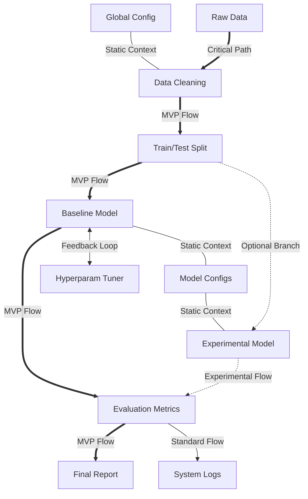
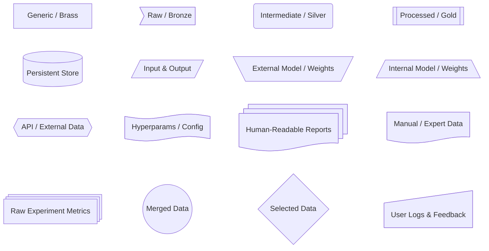

# Visual Modeling Standards

The definitions below outline the semantic rules for interaction flows, execution states, and data artifact taxonomy used throughout this documentation.

## Interaction Flows & Dependencies

The edges connecting nodes in our diagrams represent the nature of the relationship and the priority of the data flow. We distinguish between the Critical Path (essential steps for the project's Minimum Viable Product), standard data transformations, and optional or experimental branches. Additionally, specific line styles indicate static dependencies (read-only context) and iterative feedback loops, providing a clear map of how data and control propagate through the system.

---

| Syntax | Line Style | Project Meaning |
| :--- | :--- | :--- |
| `A ===> B` | **Thick Solid** | **Critical Path (MVP):** The core pipeline. Essential steps for thesis completion ("Rice and Beans"). |
| `A --> B` | **Solid Arrow** | **Standard Flow:** Normal data transformation flow or sub-steps within a major process. |
| `A -.-> B` | **Dotted Arrow** | **Experimental/Optional:** Secondary paths, "Nice-to-have" features, or exploratory branches ("The Dessert"). |
| `A --- B` | **Solid Line** | **Context/Read-Only:** Static dependency. Data is accessed/read but not consumed/transformed (e.g., Configs). |
| `A <--> B` | **Double Arrow** | **Feedback Loop:** Iterative process, optimization cycles, or bidirectional data exchange. |

## Execution Status Lifecycle

To facilitate project tracking and roadmap visualization, a semantic color palette is applied to diagram nodes based on their current development state. This color-coding allows for an immediate assessment of the project's progress, clearly distinguishing between completed assets, currently active tasks, mandatory milestones, and planned future features (backlog), as well as identifying deprecated or aborted approaches.

---

| Class | Style Preview | Meaning |
| :--- | :--- | :--- |
| `:::done` | Green (Solid) | **Done:** Completed artifacts or processes. |
| `:::active`| Yellow (Bold) | **Active:** Currently work-in-progress. |
| `:::must` | Pink (Solid) | **Must:** Mandatory milestones. High priority. |
| `:::todo` | Blue (Dashed) | **Todo:** Planned future tasks (Backlog). |
| `:::dropped`| **Gray (Faded)**| **Aborted:** Features or paths that were discarded or de-prioritized. |

## Data Artifact Taxonomy

Given the data-centric nature of this research, distinguishing between data types and their maturity levels is crucial. We employ a specific shape taxonomy to categorize artifacts, following a modified "Medallion Architecture" (Bronze, Silver, Gold) adapted for LLM pipelines. This taxonomy visually separates raw inputs, intermediate in-memory structures, consolidated corpora, persistent storage, and model weights (both internal and external), ensuring that the state of any data asset is instantly recognizable.

---

| Shape | Mermaid Syntax | Project Meaning |
| :--- | :--- | :--- |
| **Rectangle** | `id[Text]` | **Brass:** Generic, unclassified, or miscellaneous data. |
| **Asymmetric** | `id>Text]` | **Bronze:** Immutable raw source files (PDFs, HTML dumps). |
| **Round Edge** | `id(Text)` | **Silver:** Intermediate, transient, or in-memory data (e.g., extracted JSON). |
| **Subroutine** | `id[[Text]]` | **Gold:** Processed, structured, and consolidated corpus. |
| **Cylinder** | `id[(Text)]` | **Persistent Store:** Indexed Databases (Vector DB, Graph DB). |
| **Parallelogram** | `id[/Text/]` | **I/O:** Dynamic inputs, user prompts, test questions. |
| **Inv. Trapezoid**| `id[\Text/]` | **External Model:** Base models/weights downloaded (e.g., Llama 3.1 Base). |
| **Trapezoid** | `id[/Text\]` | **Internal Model:** Weights/Models trained or fine-tuned by your experiments. |
| **Hexagon** | `id{{Text}}` | **API:** External services or data sources accessed via network (e.g., Oracle). |
| **Flag**| `@{ shape: flag }`| **Params:** Configuration files, hyperparameters, single text assets. |
| **Stacked Docs** | `@{ shape: docs }`| **Reports:** Human-readable documents (PDF, Markdown, Latex) generated from experiments. |
| **Document** | `@{ shape: doc }` | **Manual Entry:** Hand-crafted data, expert QA pairs, or manually inserted datasets (Ground Truth). |
| **Process Stack**| `@{ shape: processes }`| **Metrics:** Raw internal data, metrics, logs, and experiment states (source for reports). |
| **Circle** | `id((Text))` | **Merged Data:** A single unified dataset resulting from the combination of multiple sources. |
| **Rhombus** | `id{Text}` | **Selected Data:** A specific dataset filtered or selected from a larger pool based on logic. |
| **Manual Input** | `@{ shape: manual-input }`| **User Data:** Logs, chat history, feedback, and personal info provided by users. |

---
