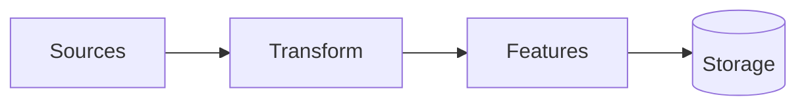

# Datasets Design

<!-- TODO(!documentation): Add high-level data pipeline diagram
     Create a Mermaid flowchart showing the complete data lifecycle.
     Should cover Sources → Transform → Features → Storage.
     labels: documentation, diagram -->

This section documents the design decisions and workflows for the data pipeline. It covers how pharmaceutical data is acquired, cleaned, transformed, and prepared for model training.

## 📊 Overview

The Datasets module follows a three-stage architecture:

| Stage | Purpose | Status |
|:------|:--------|:-------|
| **Sources** | Data acquisition from external portals | In Progress |
| **Transform** | Cleaning, normalization, extraction | Planned |
| **Features** | Tokenization, embedding, metadata | Planned |

## 📂 Subsections

- [**Sources**](sources/index.md) - Scraping and download workflows
- [**Transform**](transform/index.md) - Data cleaning and extraction pipelines
- **Features** - Feature engineering (coming soon)

---

> **See also:** [API Reference - Datasets](../../reference/datasets/index.md) for code documentation.
