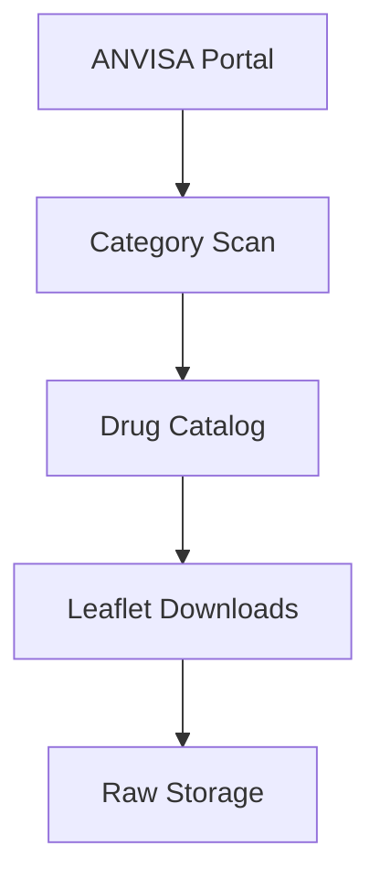

# ANVISA Source Design

<!-- TODO(!documentation): Document ANVISA portal structure changes
     Portal UI changes can break scrapers. Document known change patterns
     and implement monitoring strategy.
     labels: documentation, data-sources -->

The ANVISA (Agência Nacional de Vigilância Sanitária) module handles data acquisition from Brazil's national health regulatory agency.

## 📋 Data Flow Overview

## 📂 Modules

| Module | Purpose | Design Doc |
|:-------|:--------|:-----------|
| **Categories** | Regulatory category scraping | [View](categories.md) |
| **Leaflets** | PDF download orchestration | *Planned* |

<!-- TODO(!documentation): Create leaflets module design
     Document PDF download strategy, deduplication, and storage.
     labels: documentation, data-sources -->

## 🔗 External References

- [ANVISA Bulário Eletrônico](https://consultas.anvisa.gov.br/#/bulario/)
- [ANVISA Open Data](https://dados.anvisa.gov.br/)

---

> **See also:** [API Reference - ANVISA](../../../../reference/datasets/sources/anvisa/index.md)
