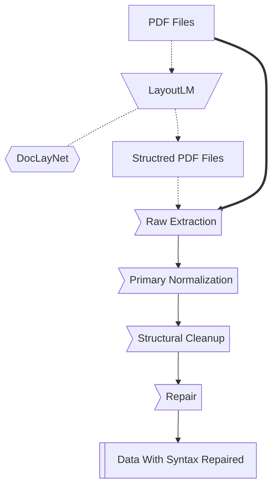

# Extraction Package

## PDF Extraction Diagram

```mermaid
flowchart TD

    PDF[PDF Files]
    Layout[\LayoutLM/] -.- DLN{{DocLayNet}}
    EPDF[Structred PDF Files]

    PDF ~~~ DLN  ~~~ PExt

    PExt>Raw Extraction]
    PNorm>Primary Normalization]
    PCorr>Structural Cleanup]
    PRep>Repair]
    POut@{ shape: lin-rect, label: "Data With Syntax Repaired" }

    PDF -.-> Layout -.-> EPDF -.-> PExt
    PDF ==> PExt --> PNorm --> PCorr --> PRep --> POut

```

## HTML Extraction Diagram

```mermaid
flowchart TD

    HTML[HTML Files]
    DOM[/Layout DOM\] -.- DLD{{DOMLayoutData}}
    EHTML[Structred HTML Files]

    HTML ~~~ DLD  ~~~ HExt

    HExt>Raw Extraction]
    HNorm>Primary Normalization]
    HCorr>Structural Cleanup]
    HRep>Repair]
    HOut@{ shape: lin-rect, label: "Data With Syntax Repaired" }

    HTML -.-> DOM -.-> EHTML -.-> HExt
    HTML ==> HExt --> HNorm --> HCorr --> HRep --> HOut

```
