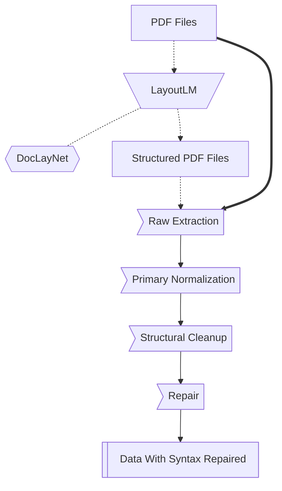
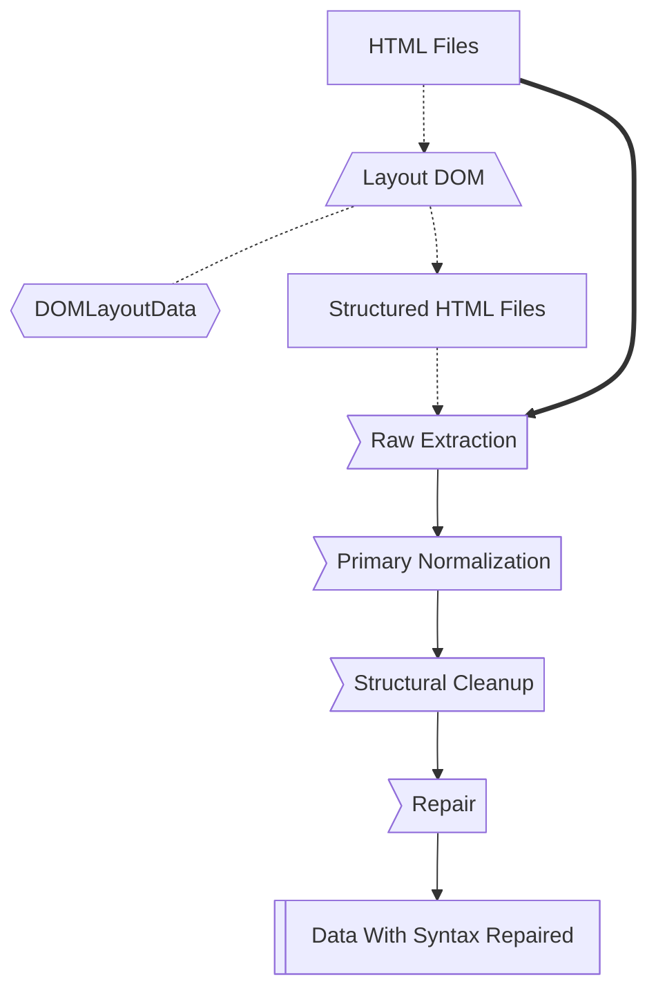

# Extraction Pipeline Design

<!-- TODO(!documentation): Evaluate LayoutLM vs rule-based extraction
     Compare accuracy, speed, and maintenance cost between ML-based
     document understanding and traditional parsing approaches.
     labels: documentation, research -->

This document describes the extraction pipeline for converting raw PDF and HTML documents into structured data.

## 🎯 Objectives

1. Extract text content preserving semantic structure
2. Identify and parse tabular data
3. Handle multi-column layouts and complex formatting
4. Normalize encoding and special characters

## 📄 PDF Extraction Pipeline

<!-- TODO(!documentation): Benchmark PDF extraction libraries
     Compare PyMuPDF, pdfplumber, and camelot for ANVISA leaflets.
     Document extraction quality metrics.
     labels: documentation, research -->

### Stage Descriptions

| Stage | Input | Output | Tools |
|:------|:------|:-------|:------|
| Raw Extraction | PDF binary | Raw text + positions | PyMuPDF |
| Primary Normalization | Raw text | UTF-8 normalized | Python stdlib |
| Structural Cleanup | Normalized text | Logical sections | Custom rules |
| Repair | Sections | Valid structured data | Validation |

## 🌐 HTML Extraction Pipeline

<!-- TODO(!documentation): Document HTML extraction edge cases
     ANVISA portal uses Angular, document dynamic content handling.
     labels: documentation, data-pipeline -->

## ⚠️ Known Challenges

<!-- TODO(!documentation): Document extraction failure modes
     Catalog common PDF issues: scanned images, corrupted files,
     non-standard encodings. Define fallback strategies.
     labels: documentation, data-quality -->

1. **Scanned PDFs** - Require OCR preprocessing
2. **Multi-column layouts** - Column detection can fail
3. **Tables spanning pages** - Header detection issues
4. **Special characters** - Pharmaceutical symbols and units

---

> **Implementation:** See [drugslm.process](../../../reference/datasets/index.md) for code documentation.
