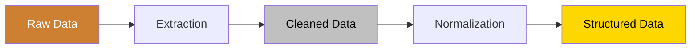

# Transform Design

<!-- TODO(!documentation): Define transformation pipeline stages
     Document the complete Bronze → Silver → Gold data flow.
     Include validation checkpoints and quality gates.
     labels: documentation, data-pipeline -->

This section documents the data transformation pipeline that converts raw scraped data into clean, structured datasets ready for model training.

## 🔄 Pipeline Stages

## 📂 Modules

| Module | Purpose | Design Doc |
|:-------|:--------|:-----------|
| **Extractor** | PDF/HTML content extraction | [View](extractor.md) |
| **Normalizer** | Text normalization and cleaning | *Planned* |
| **Validator** | Schema validation and QA | *Planned* |

<!-- TODO(!documentation): Create normalizer design documentation
     Document text cleaning rules, encoding handling, and standardization.
     labels: documentation, data-pipeline -->

<!-- TODO(!documentation): Create validator design documentation
     Document schema validation, data quality metrics, and rejection criteria.
     labels: documentation, data-pipeline -->

---

> **See also:** [Architecture Standards](../../../architecture/standards.md) for data artifact taxonomy.
