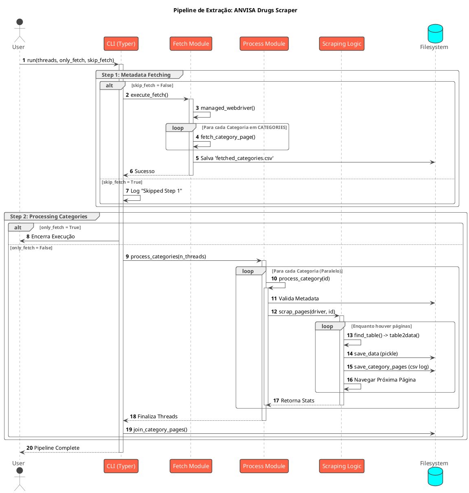

# Fetch and Get Index (UML Test)

```plantuml
@startuml
!theme vibrant
title Pipeline de Extração: ANVISA Drugs Scraper
autonumber

actor "User" as User
participant "CLI (Typer)" as CLI
participant "Fetch Module" as Fetcher
participant "Process Module" as Proc
participant "Scraping Logic" as Core
database "Filesystem" as FS

User -> CLI: run(threads, only_fetch, skip_fetch)
activate CLI

group Step 1: Metadata Fetching
    alt skip_fetch = False
        CLI -> Fetcher: execute_fetch()
        activate Fetcher
        Fetcher -> Fetcher: managed_webdriver()

        loop Para cada Categoria em CATEGORIES
            Fetcher -> Fetcher: fetch_category_page()
        end

        Fetcher -> FS: Salva 'fetched_categories.csv'
        Fetcher --> CLI: Sucesso
        deactivate Fetcher
    else skip_fetch = True
        CLI -> CLI: Log "Skipped Step 1"
    end
end

group Step 2: Processing Categories
    alt only_fetch = True
        CLI -> User: Encerra Execução
    else only_fetch = False
        CLI -> Proc: process_categories(n_threads)
        activate Proc

        loop Para cada Categoria (Paralelo)
            Proc -> Proc: process_category(id)
            activate Proc

            Proc -> FS: Valida Metadata
            Proc -> Core: scrap_pages(driver, id)
            activate Core

            loop Enquanto houver páginas
                Core -> Core: find_table() -> table2data()
                Core -> FS: save_data (pickle)
                Core -> FS: save_category_pages (csv log)
                Core -> Core: Navegar Próxima Página
            end

            Core --> Proc: Retorna Stats
            deactivate Core
            deactivate Proc
        end

        Proc --> CLI: Finaliza Threads
        deactivate Proc

        CLI -> FS: join_category_pages()
    end
end

CLI --> User: Pipeline Complete
deactivate CLI
@enduml
```
