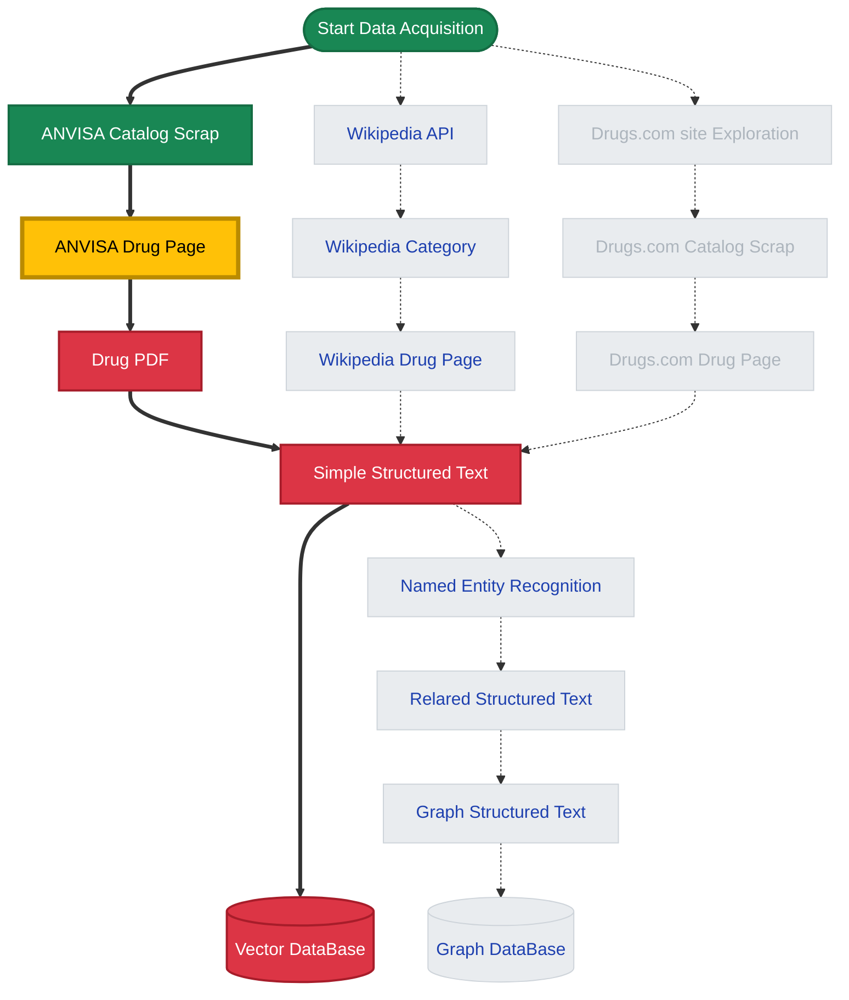

# High Level UML

Not implemented yet

```mermaid
flowchart TD
    classDef done fill:#198754,stroke:#146c43,stroke-width:2px,color:white;
    classDef active fill:#ffc107,stroke:#ba8b00,stroke-width:4px,color:black;
    classDef mvp fill:#dc3545,stroke:#a71d2a,stroke-width:2px,color:white;
    classDef future fill:#e9ecef,stroke:#ced4da,stroke-width:1px,color:#1e40af;
    classDef dead fill:#e9ecef,stroke:#ced4da,stroke-width:1px,color:#adb5bd;
        
     %% ETAPA 1: AQUISIÇÃO DE DADOS  
    
    Begin([Start Data Acquisition]):::done
    
    Catalog[ANVISA Catalog Scrap]:::done
    AnvisaPage[ANVISA Drug Page]:::active
    PDF[Drug PDF]:::mvp 
    
    WikiAPI[Wikipedia API]:::future
    Wiki[Wikipedia Category]:::future
    WikiPage[Wikipedia Drug Page]:::future
    
    Drugs[Drugs.com site Exploration]:::future
    DrugsCat[Drugs.com Catalog Scrap]:::future
    DrugsPage[Drugs.com Drug Page]:::future
    
    SST[Simple Structured Text]:::mvp
    NER[Named Entity Recognition]:::future
    RST[Relared Structured Text]:::future
    GST[Graph Structured Text]:::future
    
    VDB[(Vector DataBase)]:::mvp
    GDB[(Graph DataBase)]:::future

    Begin ==> Catalog ==> AnvisaPage ==> PDF ==> SST
    Begin -.-> WikiAPI -.-> Wiki -.-> WikiPage -.-> SST
    Begin -.-> Drugs -.-> DrugsCat -.-> DrugsPage -.-> SST
            
    SST =====> VDB
    SST -.-> NER -.-> RST -.-> GST -.-> GDB
    
    class Drugs dead
    class DrugsCat dead
    class DrugsPage dead

    click Catalog "../reference/scraper/anvisa/catalog" "See Catalog Activity Diagram and Docs"

```
