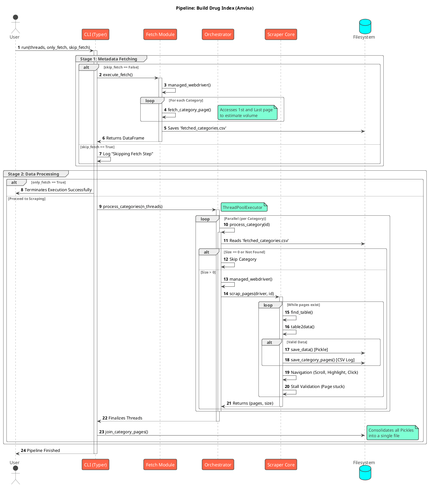

# Build Index Module

## Index Construction Pipeline

The main script (`build_index.py`) operates following the flow below:

## API

The core scraper logic responsible for navigating the ANVISA portal, handling pagination, and extracting tabular data.
This data contains the real url for each drugs in ANVISA webpage.

::: drugslm.scraper.anvisa.build_index
    options:
        show_source: true
