# Anvisa Catalog Module

## Catalog Construction Pipeline

The module `drugslm.scraper.anvisa.catalog` operates following the flow below:

```mermaid
sequenceDiagram
    autonumber
    title Pipeline: Build Drug Index (Anvisa)

    actor User
    participant CLI as CLI (Typer)
    participant Fetch as Fetch Logic
    participant Orch as Orchestrator
    participant Core as Scraper Core
    participant FS as Filesystem

    User->>CLI: run(threads, force, check, ...)
    activate CLI

    %% === CHECK MODE ===
    alt check == True
        CLI->>FS: check_catalog()
        note right of CLI: Compares Local Catalog<br/>vs Remote Metadata
        FS-->>CLI: Consistency Report
        CLI-->>User: Logs & Exits
    end

    %% === STAGE 1: METADATA ===
    alt skip_fetch == False
        rect rgb(30, 30, 30)
        note right of User: Stage 1: Metadata Fetching
        CLI->>Fetch: fetch_metadata()
        activate Fetch
        Fetch->>FS: rotate_file(METADATA)
        
        loop For each Category
            Fetch->>Fetch: fetch_category_metadata()
            Fetch->>Fetch: managed_webdriver()
            note right of Fetch: Access 1st & Last page<br/>to estimate volume
        end

        Fetch->>FS: Save 'metadata.csv'
        Fetch-->>CLI: Metadata Saved
        deactivate Fetch
        end
    end

    alt fetch_only == True
        CLI-->>User: Exit (Fetch Complete)
    end

    %% === STAGE 2: SCRAPING ===
    rect rgb(35, 35, 35)
    note right of User: Stage 2: Data Processing

    CLI->>Orch: scrap_categories(n_threads, force)
    activate Orch
    
    Orch->>FS: delete_lock_progress()

    alt force == True
        Orch->>FS: delete_chunks(all)
        Orch->>FS: rotate_file(PROGRESS)
        Orch->>FS: rotate_file(CATALOG)
    end

    note right of Orch: ThreadPoolExecutor

    loop Parallel (per Category)
        Orch->>Orch: scrap_unit_category(id)
        Orch->>FS: get_metadata(id)
        
        alt Valid Metadata
            Orch->>Orch: managed_webdriver()
            Orch->>Core: scrap_pages(driver, id, force)
            activate Core

            %% Resume Logic
            alt force == False AND History Exists
                Core->>FS: get_last_processed_page()
                Core->>Core: goto_last_processed_page()
            else force == True OR No History
                Core->>FS: delete_chunks(id)
            end

            %% Page Loop
            loop While pages exist
                Core->>Core: find_table()
                Core->>Core: table2data()

                alt Valid Data
                    Core->>FS: save_chuck() [Pickle]
                    Core->>FS: save_progress() [CSV + Lock]
                end

                Core->>Core: Navigation (Next Page)
            end

            Core-->>Orch: Category Finished
            deactivate Core
        end
    end

    Orch->>Orch: Threads Finished

    %% Consolidation
    Orch->>FS: join_chunks()
    note right of Orch: Consolidates Pickles,<br/>Deduplicates & Saves Catalog
    Orch->>FS: delete_chunks(all)

    Orch-->>CLI: Pipeline Finished
    deactivate Orch
    end
    
    CLI-->>User: Process Complete
    deactivate CLI
```

## API

The core scraper logic responsible for navigating the ANVISA portal, handling pagination, and extracting tabular data.
This data contains the real url for each drugs page in ANVISA webpage.

::: drugslm.scraper.anvisa.catalog
    options:
        show_source: true
