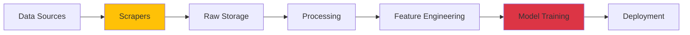

# DrugsLM

[](https://cookiecutter-data-science.drivendata.org/)
[](https://www.python.org/downloads/)
[](LICENSE)

## Small Language Model (SLM) for Pharmaceutical Information

Master's thesis in Computer Science at the Federal University of Paraná (UFPR), focusing on the development of a specialized language model using drug package inserts and medical databases.

---

## 🎯 Overview

DrugsLM is a research project that aims to create a domain-specific language model trained on pharmaceutical data from regulatory agencies. Unlike general-purpose LLMs, DrugsLM focuses on:

- **Accuracy**: Training exclusively on verified sources (ANVISA, FDA, medical literature)
- **Multilingual**: Primary focus on Portuguese with English expansion
- **Efficiency**: Small Language Model design for reduced computational requirements
- **Traceability**: Complete data lineage from source to model

---

## 🚀 Quick Start

### Prerequisites

- **Docker & Docker Compose** (recommended)
- **Python 3.12** with [uv](https://github.com/astral-sh/uv) package manager
- **Selenium Hub** (for web scraping) - optional, configurable via `HUB_URL`

### Installation

#### Option 1: Using Docker (Recommended)

```bash
# Clone the repository
git clone https://github.com/yourusername/drugslm.git
cd drugslm

# Start services
docker compose up -d drugslm  # Base container
docker compose up -d mkdocs   # Documentation server (localhost:8000)
docker compose up -d dagster  # Orchestration UI (localhost:3000)

# Attach to container
docker exec -it drugslm_base bash
```

#### Option 2: Local Development

```bash
# Install uv package manager
curl -LsSf https://astral.sh/uv/install.sh | sh

# Setup development environment
make install  # Install uv (if not already installed)
make dev      # Create venv and install all dependencies

# Activate environment
source .venv/bin/activate

# Or use uv directly (no activation needed)
uv run python -m drugslm.scraper.anvisa.catalog --help
```

### Running Your First Scraper

```bash
# Fetch metadata from ANVISA categories
uv run python -m drugslm.scraper.anvisa.catalog run --fetch-only

# Run full scraping pipeline (single-threaded)
uv run python -m drugslm.scraper.anvisa.catalog run

# Parallel execution with 4 threads
uv run python -m drugslm.scraper.anvisa.catalog run --threads 4

# Check data consistency
uv run python -m drugslm.scraper.anvisa.catalog run --check
```

---

## 📁 Project Structure

```
drugslm/
├── dagster/                   # Orchestration layer (mirrors drugslm/)
│   ├── scraper/              # Dagster assets for data acquisition
│   └── modeling/             # Dagster pipelines for training
│
├── drugslm/                   # Core Python package
│   ├── scraper/              # Data acquisition modules
│   │   ├── anvisa/           # ANVISA scraper (active)
│   │   │   ├── catalog.py    # Drug listing scraper
│   │   │   ├── leaflets.py   # PDF download module
│   │   │   ├── pipelines.py  # Dagster integration
│   │   │   └── config.py     # ANVISA-specific config
│   │   ├── wikipedia/        # Wikipedia scraper (planned)
│   │   └── selenium.py       # Shared browser automation
│   │
│   ├── modeling/             # Model training and evaluation
│   ├── features/             # Feature engineering
│   ├── database/             # Database connectors
│   │   ├── pg/              # PostgreSQL
│   │   └── neo4j/           # Neo4j graph database
│   ├── utils/               # Shared utilities
│   │   ├── logging.py       # Logging configuration
│   │   └── asserts.py       # Validation helpers
│   └── config.py            # Global configuration
│
├── data/                      # Data directory (gitignored)
│   ├── raw/                  # Immutable source data
│   │   └── anvisa/          # ANVISA scraped data
│   │       └── index/       # Drug catalog and metadata
│   ├── interim/             # Intermediate transformed data
│   ├── processed/           # Final analysis-ready datasets
│   └── external/            # Third-party data sources
│
├── models/                    # Trained models and artifacts
├── notebooks/                 # Jupyter notebooks for exploration
├── docs/                      # MkDocs documentation source
├── tests/                     # Pytest test suite
│
├── docker-compose.yaml        # Multi-service orchestration
├── Dockerfile                 # Development container definition
├── Makefile                   # Development shortcuts
├── pyproject.toml            # Python package configuration
└── mkdocs.yaml               # Documentation configuration
```

### Key Directories

- **`drugslm/scraper/`**: Modular scrapers for each data source (ANVISA, Wikipedia, etc.)
- **`dagster/`**: Dagster assets and pipelines that mirror the `drugslm/` structure
- **`data/raw/anvisa/index/`**: Scraped catalog stored as pickle/CSV with checkpointing
- **`docs/`**: Full documentation built with MkDocs Material

---

## 🛠️ Development Workflow

### Common Commands

```bash
# Environment Management
make dev          # Setup full dev environment
make build        # Production build (main dependencies only)
make clean        # Remove Python artifacts and caches
make purge        # Nuclear option: remove venv + artifacts

# Code Quality
make lint         # Check code style with ruff
make format       # Auto-format code with ruff
make test         # Run pytest suite

# Services
make dagster up   # Start Dagster dev server (0.0.0.0:3000)
make docs up      # Serve documentation with live reload (0.0.0.0:8000)
make dagster down # Stop Dagster
make docs down    # Stop MkDocs
```

### Documentation

Access full documentation at `http://localhost:8000` when running `make docs up`, or visit the ~~online docs~~ (TODO: add GitHub Pages link).

---

## 🏗️ Architecture Overview

The project follows a modular data pipeline architecture:



**Current Focus**: Data acquisition layer (scrapers) and raw data validation.

For detailed architecture decisions, see [Architecture Documentation](architecture.md).

---

## 📊 Data Sources

### Active

- **ANVISA** (Brazilian Health Regulatory Agency)
- ~40,000+ registered medications
- Official package inserts (PDF)
- Regulatory metadata

### Planned

- **Wikipedia** (Multilingual drug information)
- **PubMed/Medical Literature**

---

## 🤝 Contributing

This is an active research project. Contributions, suggestions, and feedback are welcome:

1. Open an issue for bugs or feature requests
2. Fork the repository for pull requests
3. Follow existing code style (enforced by `ruff`)

---

## 📝 Citation

If you use this work in your research, please cite:

```bibtex
@mastersthesis{goncalves2025drugslm,
  author  = {Gonçalves, Vinícius de Lima},
  title   = {DrugsLM: A Small Language Model for Pharmaceutical Information},
  school  = {Federal University of Paraná},
  year    = {2025},
  type    = {Master's Thesis},
  address = {Curitiba, Brazil}
}
```

---

## 📄 License

This project is licensed under the BSD 3-Clause License - see the [LICENSE](LICENSE) file for details.

---

## 👤 Author

**Vinícius de Lima Gonçalves**  
Master's Student in Computer Science  
Federal University of Paraná (UFPR)  
Curitiba, Brazil

---

**Documentation**: [Getting Started](getting-started.md) | [Architecture](architecture.md) | [API Reference](reference/)
