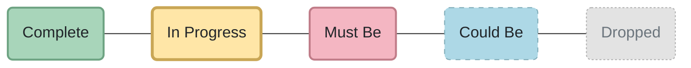

```mermaid
flowchart TD

    %% Definição de Estilos
    classDef done fill:#a8d5ba,stroke:#6da382,stroke-width:2px,color:#212529;
    classDef active fill:#ffe6a7,stroke:#c9a655,stroke-width:3px,color:#212529;
    classDef must fill:#f4b6c2,stroke:#c07c88,stroke-width:2px,color:#212529;
    classDef could fill:#add8e6,stroke:#7daab6,stroke-width:1px,stroke-dasharray: 5 5,color:#212529;
    classDef drop fill:#e9ecef,stroke:#b0b0b0,stroke-width:1px,stroke-dasharray: 2 2,color:#6c757d;

    %% Subgrafo Unificado: Ingestão e Processamento
    subgraph Pipeline [Data Ingestion & Processing Pipeline]
        
        %% Track ANVISA
        AnvisaCat[ANVISA Catalog]:::done
        AnvisaPage[Drug HTML Pages]:::active
        AnvisaPDF[Package Insert PDFs]:::must
        AExt[PDF Text Extraction]:::must
        AProc[ANVISA Processor]:::must

        %% Track Wikipedia
        WikiA[Wiki Categories]:::could
        Wiki[Wiki Categories]:::could
        WikiPage[Wiki Articles]:::could
        WExt[HTML Extraction]:::could
        WProc[Wiki Processor]:::could

        %% Track Drugs.com
        DrugsA[Drugs.com Catalog]:::drop
        Drugs[Drugs.com Catalog]:::drop
        DrugsPage[Drugs.com Pages]:::drop
        DExt[HTML Extraction]:::drop
        DProc[Drugs Processor]:::drop

        %% Convergence Point
        SST[SST: Simple Structured Text]:::must

        %% Fluxos
        AnvisaCat ==> AnvisaPage ==> AnvisaPDF ==> AExt ==> AProc ==> SST
        WikiA -.-> Wiki -.->WikiPage --> WExt --> WProc --> SST
        DrugsA -.-> Drugs -.-> DrugsPage -.-> DExt -.-> DProc -.-> SST
    end

    %% Subgrafo: Enriquecimento Semântico (NLP)
    subgraph Enrichment [Knowledge Extraction & Structuring]
        
        %% Caminho Vetorial
        Embed[Embedding Model]:::must
        
        %% Caminho do Grafo
        NER[NER: Entity Extraction]:::must
        EntRes[Entity Resolution]:::must
        RelExt[Relation Extraction]:::could
        KGConst[Knowledge Graph Construction]:::could

        %% Conexões Lógicas
        SST ==> Embed
        SST ==> NER ==> EntRes ==> RelExt ==> KGConst
    end
    
    %% Subgrafo: Armazenamento
    subgraph Storage [Persistent Storage]
        VDB[(Vector Database)]:::must
        GDB[(Graph Database)]:::could

        Embed ==> VDB
        KGConst --> GDB
    end

    click AnvisaCat "reference/scraper/anvisa/catalog/" "See Anvisa Catalog Module"
```

# DrugsLM - Small Language Model for Drug Information

> **Master's Thesis Project** | Federal University of Paraná (UFPR) | Computer Science Department

DrugsLM is a specialized Small Language Model (SLM) trained on drug package inserts and other pharmacological databases, designed to understand and generate accurate and simple pharmaceutical information.

---

## 🎓 Academic Context

This project is part of a Master's thesis in Computer Science at the **Federal University of Paraná (UFPR)**, Curitiba, Brazil. The research focuses on:

- Democratizing access to complex pharmacological information
- Structuring unstructured data from official pharmaceutical documentation
- Domain-adaptation of Language Models for pharmacological information
- Resource-efficient fine-tuning strategies for Small Language Models (SLMs)
- Validation and reliability of Generative AI in healthcare contexts

**Researcher**: Vinícius de Lima Gonçalves  
**Advisor**: Professor Eduardo Todt, PhD  
**Institution**: Department of Computer Science, UFPR

## 🎯 Project Vision

High-quality outcomes likely depend on rigorously structured data rather than massive scale, favoring Small Language Models (SLMs). Leveraging Knowledge Graphs aims to provide precise context and granularity. Comparing architectures intends to demonstrate that data structure is key to resource-efficient, reliable pharmacological AI.

---

## 📋 Experimental Assets Lineage ( Data Roadmap )

The diagram below illustrates the complete data acquisition and processing roadmap for this project, organized as a data-centric asset chart, showing progress across all assets. Each node also has a link to the main module responsible for acquiring the respective data, whether completed or in progress.

#### Legend

---

---

## 🚀 Quick Start

  

    <h3>📖 Getting Started</h3>
    
Environment setup, Docker guide, and first scraper execution

    <a href="getting-started/">Installation Guide →</a>
  

  
  

    <h3>🏗️ Architecture</h3>
    
Technical decisions, data flows, and design patterns

    <a href="architecture/">System Design →</a>
  

  
  

    <h3>🛠️ Infrastructure</h3>
    
Container setup, Selenium Grid, and hardware specs

    <a href="infrastructure/">Deployment Info →</a>
  

  
  

    <h3>📚 API Reference</h3>
    
Module documentation, scrapers, and code examples

    <a href="reference/">Browse API Docs →</a>
  

---

**Next Steps**: [Set up your development environment →](getting-started.md)

## 🤝 Contributing

This is an active research project. If you're interested in collaborating or have suggestions, feel free to open an issue or reach out.

---

## 📄 License

This project is licensed under the BSD License. See [LICENSE](https://github.com/yourusername/drugslm/blob/main/LICENSE) for details.
