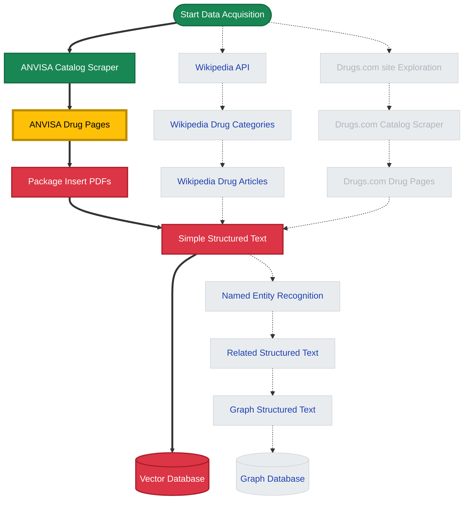

# DrugsLM - Small Language Model for Drug Information

> **Master's Thesis Project** | Federal University of Paraná (UFPR) | Computer Science Department

DrugsLM is a specialized Small Language Model (SLM) trained on drug package inserts and medical databases, designed to understand and generate accurate pharmaceutical information in Portuguese and English.

---

## 🎓 Academic Context

This project is part of a Master's thesis in Computer Science at the **Federal University of Paraná (UFPR)**, Curitiba, Brazil. The research focuses on:

- Domain-specific language model development
- Efficient training strategies for Small Language Models
- Medical information extraction and structuring
- Multilingual pharmaceutical knowledge representation

**Researcher**: Vinícius de Lima Gonçalves  
**Institution**: Department of Computer Science, UFPR

---

## 📋 Project Roadmap

The diagram below illustrates the complete data acquisition and processing roadmap for this project, organized as a data-centric asset graph showing what has been completed, what's in progress, and what's planned.

**Legend**: 🟢 Complete | 🟡 In Progress | 🔴 MVP Phase | ⚪ Planned | ⚫ Dropped

---

## 🚀 Quick Start

  

    <h3>📖 Getting Started</h3>
    
Environment setup, Docker guide, and first scraper execution

    <a href="getting-started/">Installation Guide →</a>
  

  
  

    <h3>🏗️ Architecture</h3>
    
Technical decisions, data flows, and design patterns

    <a href="architecture/">System Design →</a>
  

  
  

    <h3>🛠️ Infrastructure</h3>
    
Container setup, Selenium Grid, and hardware specs

    <a href="infrastructure/">Deployment Info →</a>
  

  
  

    <h3>📚 API Reference</h3>
    
Module documentation, scrapers, and code examples

    <a href="reference/">Browse API Docs →</a>
  

---

**Next Steps**: [Set up your development environment →](getting-started.md)

<!--
## 🎯 Project Vision

Traditional large language models often struggle with domain-specific medical information, particularly in non-English languages. DrugsLM addresses this by:

- **Specialized Training**: Focused exclusively on pharmaceutical data from regulatory agencies
- **Multilingual Support**: Primary focus on Portuguese (ANVISA) with English expansion (Wikipedia, Drugs.com)
- **Accuracy First**: Built from verified, authoritative sources rather than general web data
- **Efficient Design**: Small Language Model approach for faster inference and lower computational costs

TODO: Refine this section with a more academic tone or move to a different location
-->

## 🤝 Contributing

This is an active research project. If you're interested in collaborating or have suggestions, feel free to open an issue or reach out.

---

## 📄 License

This project is licensed under the BSD License. See [LICENSE](https://github.com/yourusername/drugslm/blob/main/LICENSE) for details.
