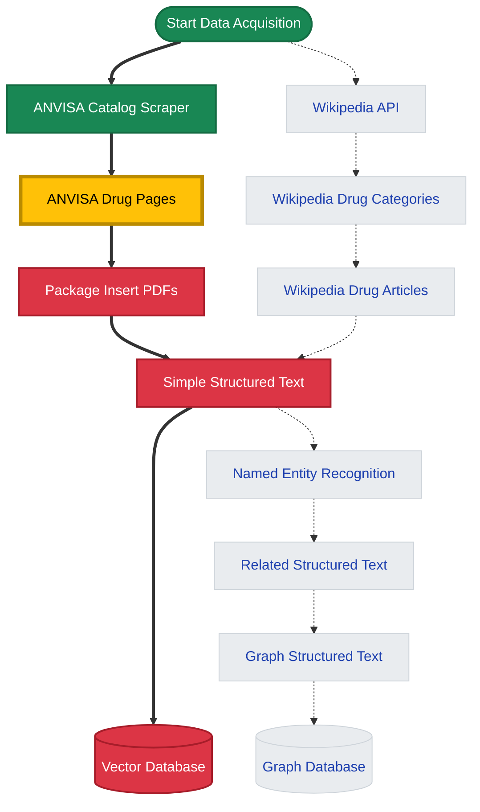

# DrugsLM - Small Language Model for Drug Information

> **Master's Thesis Project** | Federal University of Paraná (UFPR) | Computer Science Department

DrugsLM is a specialized Small Language Model (SLM) trained on drug package inserts and medical databases, designed to understand and generate accurate pharmaceutical information in Portuguese and English.

---

<!-- ## 🎯 Project Vision

Traditional large language models often struggle with domain-specific medical information, particularly in non-English languages. DrugsLM addresses this by:

- **Specialized Training**: Focused exclusively on pharmaceutical data from regulatory agencies
- **Multilingual Support**: Primary focus on Portuguese (ANVISA) with English expansion (Wikipedia, Drugs.com)
- **Accuracy First**: Built from verified, authoritative sources rather than general web data
- **Efficient Design**: Small Language Model approach for faster inference and lower computational costs

--- -->

## 🚀 Quick Start

Get started with DrugsLM in minutes:

<div style="display: grid; grid-template-columns: repeat(auto-fit, minmax(250px, 1fr)); gap: 1rem; margin: 2rem 0;">
  <div style="border: 1px solid #ddd; border-radius: 8px; padding: 1.5rem;">
    <h3>📖 Getting Started</h3>
    <p>Setup your environment and run your first scraper</p>
    <a href="getting-started/">Read the Guide →</a>
  </div>
  
  <div style="border: 1px solid #ddd; border-radius: 8px; padding: 1.5rem;">
    <h3>🏗️ Architecture</h3>
    <p>Understand the data pipeline and system design</p>
    <a href="architecture/">View Architecture →</a>
  </div>
  
  <div style="border: 1px solid #ddd; border-radius: 8px; padding: 1.5rem;">
    <h3>📚 API Reference</h3>
    <p>Explore modules, scrapers, and code documentation</p>
    <a href="reference/">Browse API Docs →</a>
  </div>
</div>

---

## 📊 Data Pipeline Overview

The project implements a comprehensive ETL pipeline for pharmaceutical data acquisition and processing:



**Legend**: 🟢 Complete | 🟡 In Progress | 🔴 MVP Phase | ⚪ Plus

---

## 🏛️ Data Sources

### Primary Sources (Active)
- **ANVISA** (Agência Nacional de Vigilância Sanitária): Brazilian regulatory agency drug database
  - Drug catalog with registration details
  - Official package inserts (bulas) in PDF format
  <!-- - ~40,000+ registered medications -->

### Planned Sources
- **Wikipedia**: Multilingual drug information articles
- **PubMed/Medical Literature**: Scientific papers and drug studies

---

## 🛠️ Technology Stack

**Core Pipeline**:
- **Dagster**: Orchestration and data lineage
- **Selenium**: Web scraping infrastructure
- **Docker**: Containerized development and deployment

**Data Processing**:
- **Pandas**: Data manipulation and analysis
- **BeautifulSoup**: HTML parsing
- **PostgreSQL**: Relational data storage
- **Neo4j**: Graph database (planned)

**Model Development**:
- **Ollama**: Local LLM experimentation
- Vector databases for semantic search
- Custom fine-tuning pipeline (in development)

---

## 📁 Project Structure

```
drugslm/
├── scraper/          # Data acquisition modules
│   ├── anvisa/       # ANVISA scraper (active)
│   ├── wikipedia/    # Wikipedia scraper (planned)
│   └── selenium.py   # Shared browser automation
├── modeling/         # Model training and evaluation
├── features/         # Feature engineering
├── database/         # Database connectors
│   ├── pg/          # PostgreSQL
│   └── neo4j/       # Neo4j (planned)
└── utils/           # Shared utilities
```

---

## 🎓 Academic Context

This project is part of a Master's thesis in Computer Science at the **Federal University of Paraná (UFPR)**, Curitiba, Brazil. The research focuses on:

- Domain-specific language model development
- Efficient training strategies for Small Language Models
- Medical information extraction and structuring
- Multilingual pharmaceutical knowledge representation

**Researcher**: Vinícius de Lima Gonçalves  
**Institution**: Department of Computer Science, UFPR

---

## 📄 License

This project is licensed under the BSD License. See [LICENSE](https://github.com/yourusername/drugslm/blob/main/LICENSE) for details.

---

## 🤝 Contributing

This is an active research project. If you're interested in collaborating or have suggestions, feel free to open an issue or reach out.

---

**Next Steps**: [Set up your development environment →](getting-started.md)