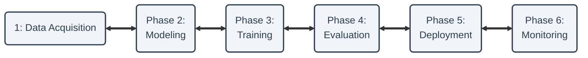

# DrugSLM - Small Language Model for Drug Information

> **Master's Thesis Project** | Federal University of Paraná (UFPR) | Computer Science Department

DrugSLM is a specialized Small Language Model (SLM) trained on drug package inserts and other pharmacological databases, designed to understand and generate accurate and simple pharmaceutical information.

## 🎓 Academic Context

This project is part of a Master's thesis in Computer Science at the **Federal University of Paraná (UFPR)**, Curitiba, Brazil. The research focuses on:

- Democratizing access to complex pharmacological information
- Structuring unstructured data from official pharmaceutical documentation
- Domain-adaptation of Language Models for pharmacological information
- Resource-efficient fine-tuning strategies for Small Language Models (SLMs)
- Validation and reliability of Generative AI in healthcare contexts

**Researcher**: Vinícius de Lima Gonçalves  
**Advisor**: Professor Eduardo Todt, PhD  
**Institution**: Department of Computer Science, UFPR

## 🎯 Project Vision

High-quality outcomes likely depend on rigorously structured data rather than massive scale, favoring Small Language Models (SLMs). Leveraging Knowledge Graphs aims to provide precise context and granularity. Comparing architectures intends to demonstrate that data structure is key to resource-efficient, reliable pharmacological AI.

## 🧬 Project Lifecycle & Roadmap

The project follows a rigorous 6-phase data-centric methodology, ensuring reproducibility and reliability from data acquisition to model deployment.

  Explore the detailed lineage regarding extraction, transformation, training strategies, and validation metrics for each phase by clicking on the nodes below.

## 🚀 Quick Start

  
  

    <h3>📖 Getting Started</h3>
    
Environment setup, container orchestration, and full pipeline reproduction guide.

    <a href="getting-started/">Installation Guide →</a>
  

  
  

    <h3>🏗️ Architecture & Design</h3>
    
Visual standards, data lineage roadmaps, and logical system design hub.

    <a href="architecture/">View Design Docs →</a>
  

  
  

    <h3>🛠️ Infrastructure</h3>
    
Hardware specifications, GPU constraints, and containerized services setup.

    <a href="architecture/infrastructure/">Hardware & Deployment →</a>
  

  
  

    <h3>📚 API Reference</h3>
    
Comprehensive module documentation, pipeline interfaces, and internal tools.

    <a href="reference/">Browse API Docs →</a>
  

## 🤝 Contributing

This is an active research project. If you're interested in collaborating or have suggestions, feel free to open an issue or reach out.

<!-- ## 📄 License

This project is licensed under the BSD License. See [LICENSE](LICENSE) for details. -->
