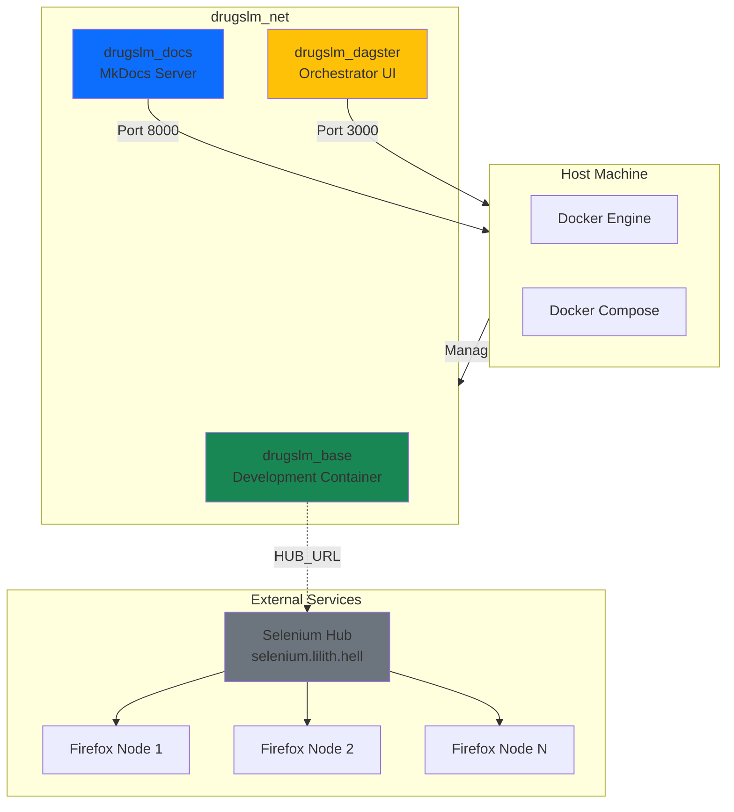
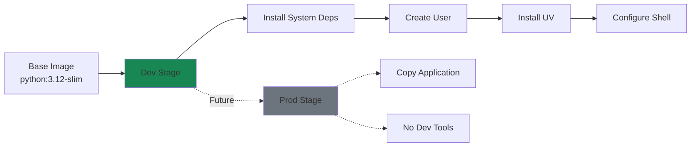
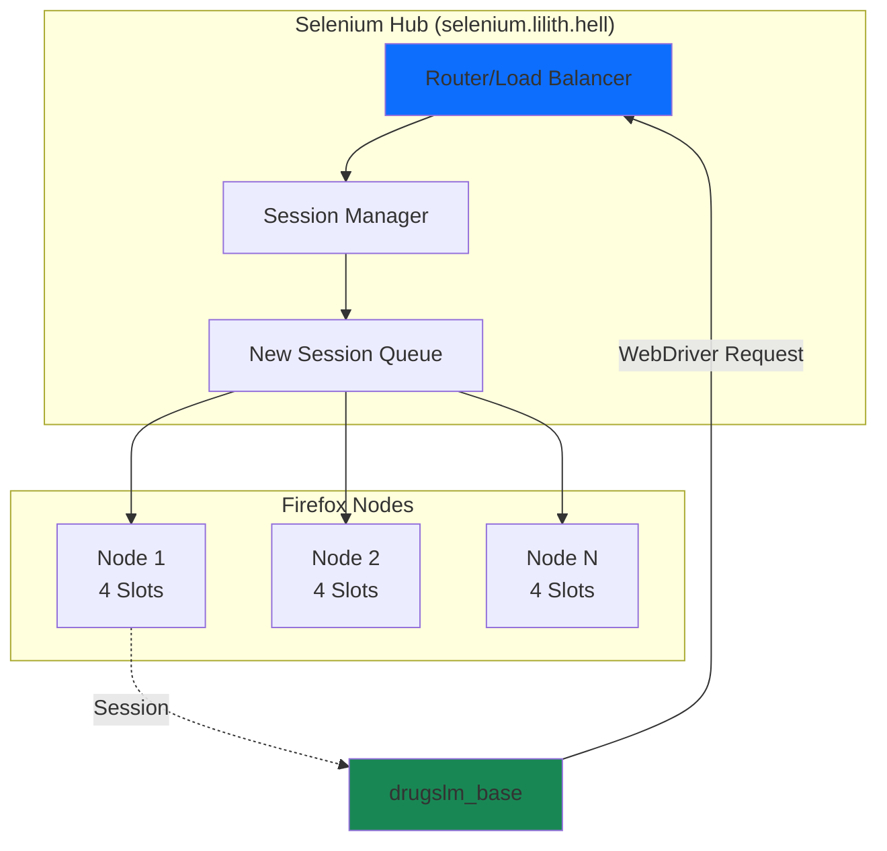
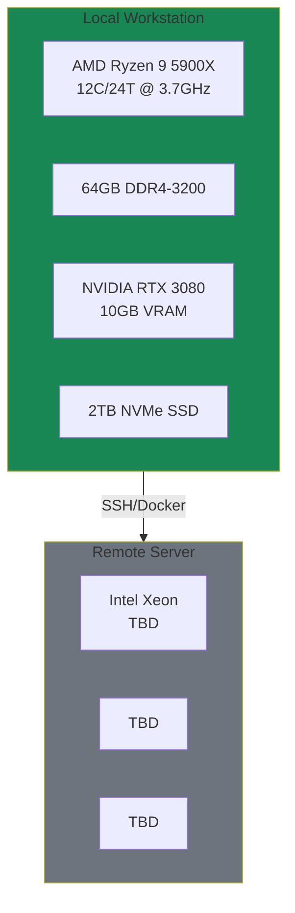
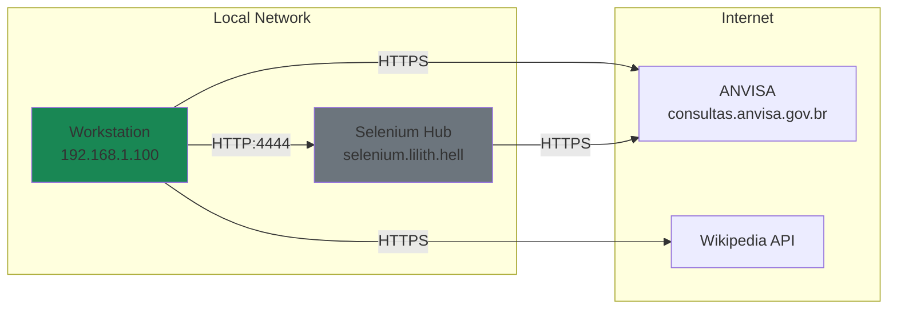
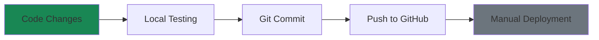
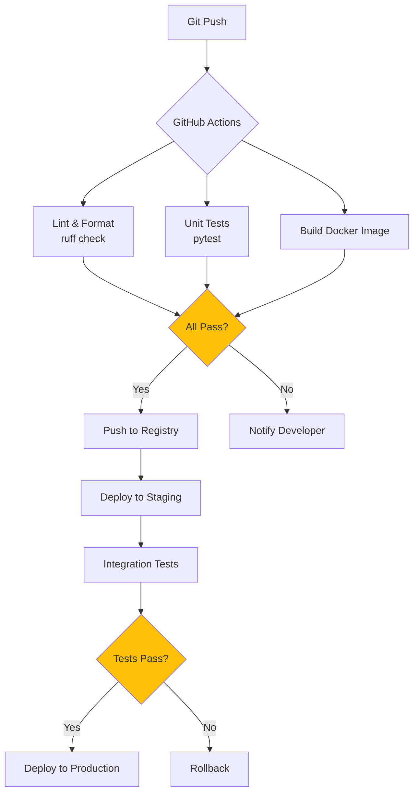
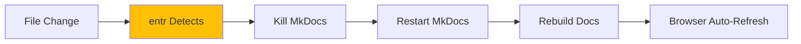
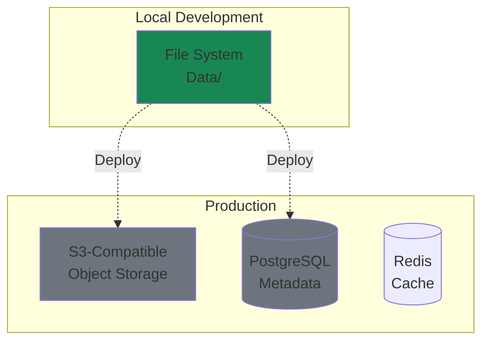

# Infrastructure

This document details the infrastructure setup, deployment configurations, and experimental hardware used in the DrugsLM project.

---

## Table of Contents

- [Development Environment](#development-environment)
- [Container Architecture](#container-architecture)
- [Selenium Grid Setup](#selenium-grid-setup)
- [Experimental Hardware](#experimental-hardware)
- [Network Topology](#network-topology)
- [CI/CD Pipeline](#cicd-pipeline)
- [Future Infrastructure](#future-infrastructure)

---

## Development Environment

### Local Setup



### Container Configuration

**Base Configuration** (`compose.yaml`):

```yaml
services:
  drugslm:
    build:
      context: .
      target: dev
    image: drugslm:0.0.2
    container_name: drugslm_base
    volumes:
      - ./:/workspace
    networks:
      - drugslm_net
    env_file:
      - .env
```

**Key Features**:
- **Hot Reload**: Code changes reflect immediately via volume mounts
- **User Mapping**: UID/GID passed as build args to prevent permission issues
- **Shared Network**: All services communicate via `drugslm_net`
- **Environment Isolation**: `.env` file for configuration

---

## Container Architecture

### Multi-Stage Dockerfile



**Dev Stage Highlights**:

```dockerfile
FROM python:3.12-slim AS dev

# System packages for development
RUN apt-get update && apt-get install -y \
    git vim make curl tree procps entr

# Non-root user with sudo access
ARG USER=devel
ARG UID=1000
ARG GID=1000

# UV package manager
RUN curl -LsSf https://astral.sh/uv/install.sh | sh

# Auto-activate venv in shell
RUN echo 'source /workspace/.venv/bin/activate' >> ~/.bashrc
```

### Entrypoint Locking

**Problem**: Multiple containers starting simultaneously can corrupt shared state.

**Solution**: File-based lock with `flock` in `entrypoint.sh`:

```bash
#!/bin/bash
set -e

LOCK=".entrypoint.lock"

(
    flock -n 9 \
        && echo "Lock acquired. Running make dev..." \
        && make dev \
        || echo "Lock held. Skipping setup."
) 9>"$LOCK"

exec "$@"
```

**Benefits**:
- Only first container runs `make dev` (uv sync)
- Others skip setup, reuse existing `.venv`
- Prevents parallel package installation conflicts

---

## Selenium Grid Setup

### External Hub Configuration



**Configuration** (`.env`):

```bash
HUB_URL="http://selenium.lilith.hell/wd/hub"
```

**Advantages**:
- **Scalability**: Add nodes without modifying scraper code
- **Resource Isolation**: Browser crashes don't affect scraper container
- **Parallel Execution**: Up to N concurrent sessions across nodes
- **Remote Debugging**: VNC access to browser sessions

### Local Selenium (Alternative)

For development without external hub:

```yaml
# compose.selenium.yaml (not included by default)
services:
  selenium-hub:
    image: selenium/hub:latest
    ports:
      - "4444:4444"
    networks:
      - drugslm_net

  firefox:
    image: selenium/node-firefox:latest
    depends_on:
      - selenium-hub
    environment:
      - SE_EVENT_BUS_HOST=selenium-hub
      - SE_EVENT_BUS_PUBLISH_PORT=4442
      - SE_EVENT_BUS_SUBSCRIBE_PORT=4443
    networks:
      - drugslm_net
```

Then set `HUB_URL=http://selenium-hub:4444/wd/hub` in `.env`.

---

## Experimental Hardware

### Current Setup

This section documents the hardware used for development and experimentation.



### Specifications

| Component | Specification | Notes |
|-----------|--------------|-------|
| **CPU** | AMD Ryzen 9 5900X | 12 cores for parallel scraping |
| **RAM** | 64GB DDR4-3200 | Sufficient for multiple browser instances |
| **GPU** | NVIDIA RTX 3080 10GB | For future model training |
| **Storage** | 2TB NVMe SSD | Fast I/O for data checkpointing |
| **OS** | Ubuntu 22.04 LTS | Docker + nvidia-container-toolkit |

### Resource Allocation

**Scraping Workload**:
- 4-8 parallel threads (Firefox instances)
- ~2GB RAM per browser instance
- Minimal CPU (I/O bound)
- ~10GB disk space per 10,000 PDFs

**Training Workload** (Future):
- GPU: Full utilization for model training
- RAM: 32GB+ for large datasets
- CPU: Data preprocessing pipelines

---

## Network Topology

### Development Network



**Key Points**:
- Scraper runs on local workstation (Docker)
- Selenium Hub on separate machine for resource isolation
- All external requests use HTTPS
- Internal communication (Hub) uses HTTP

---

## CI/CD Pipeline

### Current State

**Manual Workflow**:



### Planned Automation



---

## MkDocs Live Reload

### Watch Configuration

**Problem**: MkDocs doesn't natively watch Python source files for API doc changes.

**Solution**: Custom `entr` command in `Makefile`:

```makefile
docs:
  find docs/ drugslm/ -type f \( -name "*.py" -o -name "*.md" \) | \
    entr -r mkdocs serve -a 0.0.0.0:8000
```

**How It Works**:



**Watched Paths**:
- `docs/**/*.md` - Documentation markdown
- `drugslm/**/*.py` - Python source (for mkdocstrings)

---

## Storage Architecture

### Current: Local File System

```
/workspace/data/
├── raw/                          # Immutable source data
│   └── anvisa/
│       └── index/
│           ├── metadata.csv      # ~5KB (category stats)
│           ├── catalog.pkl       # ~20MB (40k+ records)
│           └── chunks/           # Temporary (deleted after join)
├── interim/                      # Processed data (future)
├── processed/                    # Analysis-ready (future)
└── external/                     # Third-party datasets
```

**Disk Usage Estimates**:
- Index/Catalog: ~50MB
- PDF Downloads: ~10GB (assuming 40k PDFs @ 250KB avg)
- Processed Text: ~2GB (extracted from PDFs)

### Future: Distributed Storage



---

## Future Infrastructure

### Planned Enhancements

1. **Kubernetes Deployment**
   - Helm charts for scraper workers
   - Auto-scaling based on queue depth

2. **Observability Stack**
   ```mermaid
   flowchart LR
       APP[Application] --> PROM[Prometheus]
       PROM --> GRAF[Grafana]
       APP --> LOKI[Loki]
       LOKI --> GRAF
       APP --> TEMPO[Tempo]
       TEMPO --> GRAF
   ```

3. **Data Lake**
   - MinIO for object storage
   - Delta Lake for ACID transactions
   - Parquet for analytics

4. **MLOps Platform**
   - MLflow for experiment tracking
   - Ray for distributed training
   - BentoML for model serving

---

## Cost Estimates

### Current (Free Tier)

| Resource | Cost | Notes |
|----------|------|-------|
| GitHub | $0 | Free public repository |
| Selenium | $0 | Self-hosted |
| Compute | $0 | Local workstation |
| **Total** | **$0/month** | |

### Future Production (Estimated)

| Resource | Cost | Notes |
|----------|------|-------|
| Cloud Compute | $100-200 | 2-4 vCPU workers |
| Object Storage | $20-50 | ~1TB data |
| Database | $50-100 | Managed PostgreSQL |
| Monitoring | $0 | Self-hosted Grafana |
| **Total** | **$170-350/month** | |

---

**Next**: See [API Reference](reference/) for module documentation.