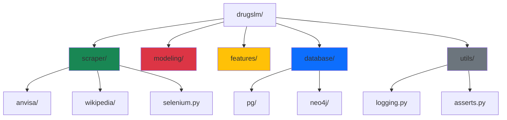

# API Reference

Welcome to the DrugsLM API documentation. This section provides detailed technical documentation for all modules, classes, and functions in the project.

---

## 📦 Module Overview

The DrugsLM codebase is organized into specialized modules, each handling a distinct aspect of the data pipeline and model development workflow.



---

## 🗂️ Core Modules

### [Scrapers](scraper/)

Data acquisition modules for extracting information from various sources.

**Status**: 🟢 Active Development

- **[ANVISA](scraper/anvisa/)**: Brazilian regulatory agency scraper (primary data source)
- **[Wikipedia](scraper/wikipedia/)**: Multilingual drug information (planned)
- **[Selenium Infrastructure](scraper/selenium/)**: Shared browser automation utilities

**Key Features**:
- Resumable execution with progress tracking
- Parallel processing with thread pools
- Automatic retry mechanisms
- Data validation and deduplication

---

### Modeling *(Planned)*

Model training, evaluation, and experimentation modules.

**Status**: ⚪ Not yet implemented

**Planned Components**:
- Training pipelines for SLM fine-tuning
- Evaluation metrics and benchmarks
- Hyperparameter optimization
- Model versioning with MLflow

---

### Features *(Planned)*

Feature engineering and data transformation modules.

**Status**: ⚪ Not yet implemented

**Planned Components**:
- Text preprocessing pipelines
- Named Entity Recognition (NER)
- Embedding generation
- Feature stores

---

### [Database](database/) *(Planned)*

Database connectors and ORM abstractions.

**Status**: ⚪ Partially implemented (structure only)

**Planned Components**:
- **PostgreSQL**: Relational metadata storage
- **Neo4j**: Graph database for drug relationships

---

### [Utils](utils/)

Shared utilities and helper functions used across the project.

**Status**: 🟢 Implemented

**Modules**:
- **[logging.py](utils/logging/)**: Centralized logging configuration with tqdm support
- **[asserts.py](utils/asserts/)**: Custom validation and assertion helpers

---

## 🎯 Quick Navigation

### By Use Case

| Use Case | Module | Documentation |
|----------|--------|---------------|
| Scrape ANVISA data | `drugslm.scraper.anvisa.catalog` | [Catalog Builder](scraper/anvisa/catalog/) |
| Configure Selenium | `drugslm.scraper.selenium` | [Selenium Infrastructure](scraper/selenium/) |
| Setup logging | `drugslm.utils.logging` | [Logging Utils](utils/logging/) |
| Validate data | `drugslm.utils.asserts` | [Assertions](utils/asserts/) |

### By Development Phase

**Phase 1: Data Acquisition** *(Current)*
- [ANVISA Scraper Overview](scraper/anvisa/)
- [Catalog Builder](scraper/anvisa/catalog/)
- [Selenium Setup](scraper/selenium/)

**Phase 2: Data Processing** *(Upcoming)*
- Feature Engineering *(planned)*
- Text Extraction *(planned)*

**Phase 3: Model Development** *(Future)*
- Training Pipelines *(planned)*
- Evaluation Framework *(planned)*

---

## 📘 Documentation Standards

All modules in this reference follow these documentation conventions:

### Docstring Format

We use **Google-style docstrings** with type hints:

```python
def example_function(param1: int, param2: str) -> bool:
    """
    Brief description of the function.

    Detailed explanation of what the function does, including
    any important behavioral notes or caveats.

    Args:
        param1: Description of first parameter
        param2: Description of second parameter

    Returns:
        Description of return value

    Raises:
        ValueError: When param1 is negative
        
    Example:
        >>> example_function(42, "test")
        True
    """
    pass
```

### Code Examples

Most module pages include:
- **Standalone Usage**: How to use the module directly via CLI
- **Programmatic Usage**: Import and call from Python code
- **Common Patterns**: Typical workflows and best practices

---

## 🔍 Search Tips

Use the search bar above to quickly find:
- **Function names**: `scrap_categories`, `get_firefox_options`
- **Class names**: `WebDriver`, `TqdmLoggingHandler`
- **Concepts**: "retry", "pagination", "checkpointing"

---

## 🛠️ Contributing to Documentation

Found an issue or want to improve the docs?

1. **Module Docstrings**: Edit directly in the source code (`.py` files)
2. **Index Pages**: Edit the corresponding markdown file in `docs/reference/`
3. **Examples**: Add to the module's markdown page or as separate files

See [Contributing Guidelines](../contributing/) for more details.

---

## 📊 Module Status Legend

- 🟢 **Implemented**: Fully functional and documented
- 🟡 **In Progress**: Partially implemented, under active development
- 🔴 **MVP Phase**: Core functionality exists, needs refinement
- ⚪ **Planned**: Design complete, implementation pending
- ⚫ **Dropped**: No longer part of the roadmap

---

**Next Steps**: Explore the [Scrapers Module](scraper/) to see the data acquisition pipeline in action.