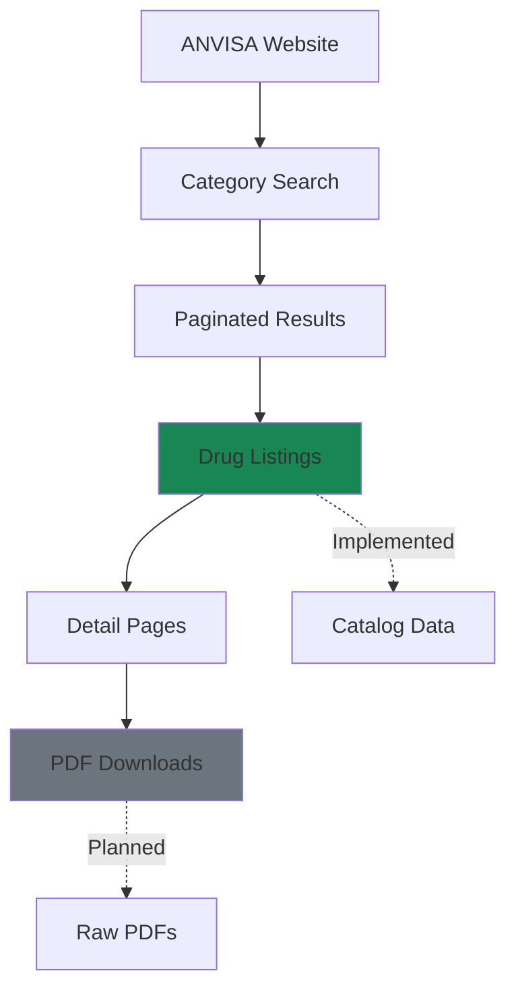
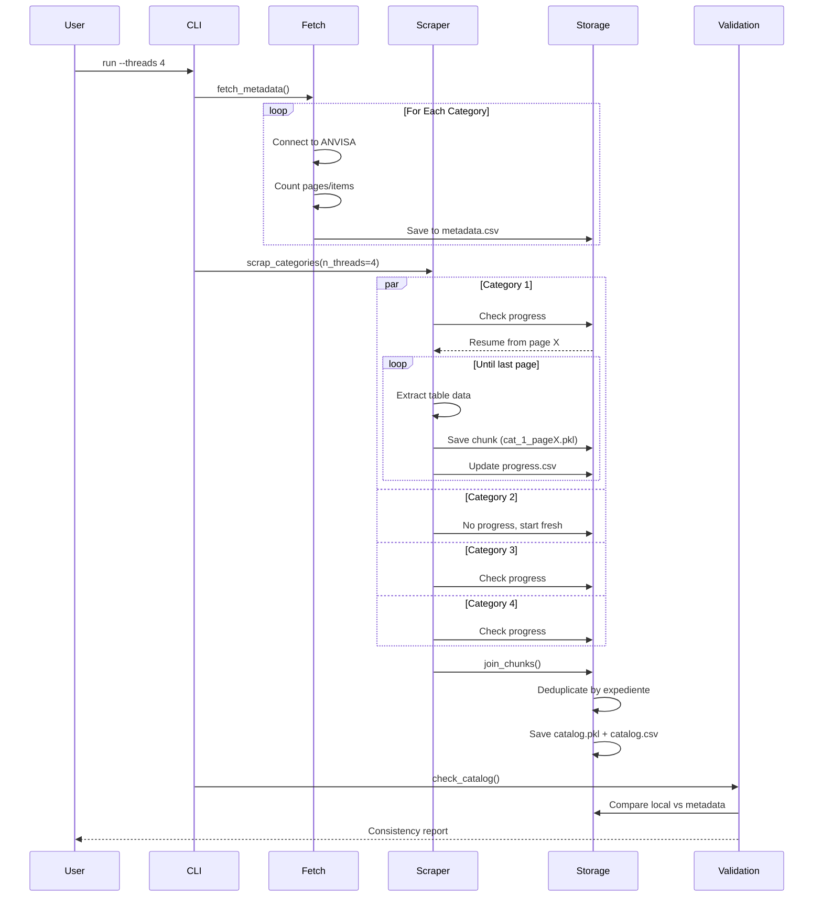

# ANVISA Scraper

The ANVISA (Agência Nacional de Vigilância Sanitária) scraper extracts drug registration data and package inserts from Brazil's national health regulatory agency.

---

## 🎯 Overview

ANVISA maintains a comprehensive database of all medications approved for use in Brazil. This scraper automates the extraction of:

- **Drug Catalog**: Metadata for ~40,000+ registered medications
- **Package Inserts** *(planned)*: PDF files with complete drug information
- **Regulatory Data**: Categories, registration numbers, publication dates



---

## 📦 Module Components

### [Catalog Builder](catalog/)

**Status**: 🟢 Fully Implemented

The catalog scraper navigates ANVISA's search interface to build a complete index of available drugs.

**Features**:
- Multi-category scraping (12 regulatory categories)
- Parallel execution with configurable thread count
- Checkpoint-based resumability
- Progress tracking and validation
- Metadata consistency checks

**CLI Usage**:
```bash
# Fetch category metadata only
uv run python -m drugslm.scraper.anvisa.catalog run --fetch-only

# Run full scraper with 4 threads
uv run python -m drugslm.scraper.anvisa.catalog run --threads 4

# Force fresh scrape (ignore checkpoints)
uv run python -m drugslm.scraper.anvisa.catalog run --force

# Validate local catalog against remote
uv run python -m drugslm.scraper.anvisa.catalog run --check
```

**Programmatic Usage**:
```python
from drugslm.scraper.anvisa.catalog import scrap_categories, get_catalog

# Run scraper
scrap_categories(n_threads=4, force=False)

# Load results
catalog_df = get_catalog()
print(f"Total drugs: {len(catalog_df)}")
```

---

### Leaflets Downloader *(Planned)*

**Status**: ⚪ Not yet implemented

Will download PDF package inserts for all cataloged drugs.

**Planned Features**:
- Batch PDF downloads with retry logic
- Content-based deduplication (same PDF for multiple entries)
- Storage optimization (compressed archives)
- Metadata extraction (PDF info, page count)

**Estimated Output**:
- ~40,000 PDFs
- ~10GB total storage
- ~250KB average file size

---

### [Pipelines](pipelines/)

**Status**: ⚪ Partially implemented (structure only)

Dagster integration for orchestrated execution.

**Planned Assets**:
```python
@asset
def anvisa_metadata() -> pd.DataFrame:
    """Fetches category metadata from ANVISA."""
    pass

@asset(deps=[anvisa_metadata])
def anvisa_catalog() -> pd.DataFrame:
    """Scrapes complete drug catalog."""
    pass

@asset(deps=[anvisa_catalog])
def anvisa_leaflets() -> List[Path]:
    """Downloads all package insert PDFs."""
    pass
```

---

### [Configuration](config/)

**Status**: 🟢 Implemented

Constants and settings specific to ANVISA scraper.

**Key Settings**:
```python
# Base URL for category searches
CATEGORIES_URL = "https://consultas.anvisa.gov.br/#/bulario/q/?categoriasRegulatorias=%s"

# Regulatory categories (1-12)
CATEGORIES = [1, 2, 3, 4, 5, 6, 7, 8, 9, 10, 11, 12]

# Output directories
INDEX_DIR = RAW_DATA_DIR / "anvisa" / "index"
```

---

## 🗂️ Data Schema

### Catalog Structure

The final catalog is a pandas DataFrame with the following schema:

| Column | Type | Description | Example |
|--------|------|-------------|---------|
| `category_id` | int | Regulatory category (1-12) | `1` |
| `category_page` | int | Page number within category | `5` |
| `medicamento` | str | Drug name | `"DIPIRONA SÓDICA"` |
| `link` | str | URL to detail page | `"/medicamento/123456"` |
| `empresa` | str | Manufacturer name | `"LABORATÓRIO XYZ LTDA"` |
| `expediente` | str | Registration number (unique ID) | `"1234567/20-9"` |
| `data_pub` | str | Publication date | `"12/08/2023"` |

**Sample Data**:
```python
>>> catalog = get_catalog()
>>> catalog.head(2)

   category_id  category_page         medicamento                    link                empresa      expediente   data_pub
0            1              1  DIPIRONA SÓDICA     /medicamento/123456  LAB XYZ LTDA    1234567/20-9  12/08/2023
1            1              1  PARACETAMOL        /medicamento/789012  FARMACO SA      7890123/21-4  15/09/2023
```

### Metadata Structure

Category metadata stored in `metadata.csv`:

| Column | Type | Description |
|--------|------|-------------|
| `category_id` | int | Category identifier |
| `page_size` | int | Items per page |
| `last_page` | int | Total pages in category |
| `num_items` | int | Total items in category |

---

## 🔄 Execution Flow

### Complete Pipeline



---

## 🛡️ Resilience Features

### 1. Progress Tracking

Every scraped page is logged to `scrap_progress.csv`:

```csv
timestamp,category_id,current_page,last_page,saved_size
20231215140523,1,10,50,50
20231215140545,1,11,50,50
20231215140608,2,1,25,50
```

**Benefits**:
- Resume execution after interruption
- Monitor real-time progress
- Audit trail for debugging

---

### 2. Checkpoint System

Each page saves independently as `{category_id}_{page_num}.pkl`:

```
data/raw/anvisa/index/chunks/
├── 1_1.pkl    # Category 1, Page 1 (50 records)
├── 1_2.pkl    # Category 1, Page 2 (50 records)
├── 1_3.pkl    # Category 1, Page 3 (50 records)
├── 2_1.pkl    # Category 2, Page 1 (50 records)
└── ...
```

**Recovery Flow**:
```python
# If scraper crashes on Category 1, Page 15:
# 1. Restart scraper
# 2. Reads scrap_progress.csv
# 3. Resumes from Page 16 (no duplicate work)
```

---

### 3. Validation System

Three-level validation ensures data quality:

**Level 1: Scrape-Time Validation**
```python
# Validates each extracted page
assert len(data) > 0, "Empty page detected"
assert all(row[3] for row in data), "Missing expediente values"
```

**Level 2: Consolidation Validation**
```python
# Checks consistency during join_chunks()
if local_size != expected_size:
    logger.warning(f"Size mismatch: {local_size} != {expected_size}")
```

**Level 3: Post-Scrape Validation**
```bash
# Manual check after completion
uv run python -m drugslm.scraper.anvisa.catalog run --check

# Output:
# Expected (Remote) :     8245
# Found    (Local)  :     8245
# Difference        :        0
```

---

## ⚙️ Configuration Options

### Environment Variables

Set in `.env` file:

```bash
# Selenium Hub URL (required for scraping)
HUB_URL="http://selenium.hub.local:4444/wd/hub"
```

### Runtime Parameters

CLI flags control execution behavior:

```bash
# Number of parallel threads (1-12)
--threads 4

# Ignore checkpoints, start fresh
--force

# Skip metadata fetch, use existing
--no-fetch

# Only fetch metadata, don't scrape
--fetch-only

# Only run validation, don't scrape
--check
```

---

## 📊 Performance Metrics

### Typical Execution Times

| Configuration | Categories | Time | Rate |
|--------------|-----------|------|------|
| Sequential (1 thread) | 12 | ~45 min | ~180 items/min |
| Parallel (4 threads) | 12 | ~12 min | ~680 items/min |
| Parallel (12 threads) | 12 | ~6 min | ~1,370 items/min |

**Assumptions**:
- ~8,000 total items across all categories
- ~2 seconds per page load
- Stable network connection

### Bottlenecks

1. **Network Latency**: Page loads (1-3 sec/page)
2. **Pagination**: Must click through pages sequentially
3. **Selenium Overhead**: Browser initialization (~5 sec)

**Optimization**: Use maximum threads (12) to parallelize across categories.

---

## 🐛 Troubleshooting

### Common Issues

#### Issue: "Selenium Hub not reachable"

**Symptom**:
```
ERROR | Failed to connect to http://selenium.hub:4444/wd/hub
```

**Solution**:
1. Verify `HUB_URL` in `.env`
2. Check Selenium Hub is running: `curl http://selenium.hub:4444/status`
3. Test network connectivity from container

---

#### Issue: "Table structure changed, restarting category"

**Symptom**:
```
WARNING | Table size inconsistent, 42 != 50. Structure changed. Restarting.
```

**Cause**: ANVISA changed page size or structure between runs.

**Solution**: Expected behavior - scraper automatically restarts category to maintain consistency.

---

#### Issue: "Missing {N} records in validation"

**Symptom**:
```
WARNING | Missing 15 records.
Expected (Remote) : 8245
Found    (Local)  : 8230
```

**Solution**:
```bash
# Re-run scraper without --force to fill gaps
uv run python -m drugslm.scraper.anvisa.catalog run --threads 4

# Verify fix
uv run python -m drugslm.scraper.anvisa.catalog run --check
```

---

## 📈 Usage Examples

### Example 1: First-Time Scrape

```bash
# 1. Fetch metadata
uv run python -m drugslm.scraper.anvisa.catalog run --fetch-only

# 2. Run scraper
uv run python -m drugslm.scraper.anvisa.catalog run --threads 4

# 3. Validate results
uv run python -m drugslm.scraper.anvisa.catalog run --check
```

---

### Example 2: Resume After Failure

```bash
# Scraper crashed midway - just re-run
uv run python -m drugslm.scraper.anvisa.catalog run --threads 4

# Output:
# >>> Resuming Category 5 from Page 12...
# >>> Skipping Category 1: already complete
```

---

### Example 3: Forced Full Re-scrape

```bash
# Delete all progress, start fresh
uv run python -m drugslm.scraper.anvisa.catalog run --force --threads 12
```

---

### Example 4: Programmatic Access

```python
from drugslm.scraper.anvisa.catalog import get_catalog, get_metadata

# Load catalog
catalog = get_catalog()

# Filter by manufacturer
xyz_drugs = catalog[catalog['empresa'].str.contains('XYZ', na=False)]

# Count by category
category_counts = catalog.groupby('category_id').size()

# Export subset
xyz_drugs.to_csv('xyz_products.csv', index=False)
```

---

## 🔗 Related Documentation

- **[Catalog Builder API](catalog/)**: Complete function reference
- **[Configuration](config/)**: All constants and settings
- **[Selenium Utils](../selenium/)**: Browser automation helpers
- **[Architecture](../../../architecture/#scraper-design)**: Design patterns and decisions

---

## 🚀 Future Enhancements

### Short Term (Q1 2025)

- [ ] PDF downloader implementation
- [ ] Dagster pipeline integration
- [ ] PostgreSQL storage option

### Medium Term (Q2 2025)

- [ ] Incremental updates (delta scraping)
- [ ] Content-based PDF deduplication
- [ ] Text extraction from PDFs

### Long Term (Q3+ 2025)

- [ ] Real-time monitoring dashboard
- [ ] Automatic data quality reports
- [ ] API endpoint for catalog access

---

**Next**: See the [Catalog Builder](catalog/) for detailed API documentation.