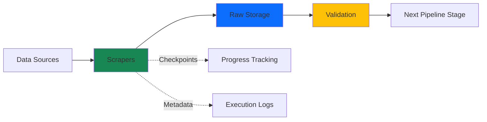
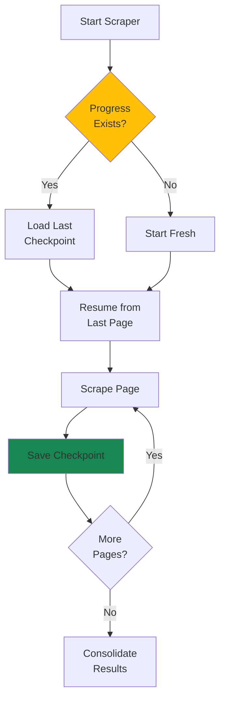
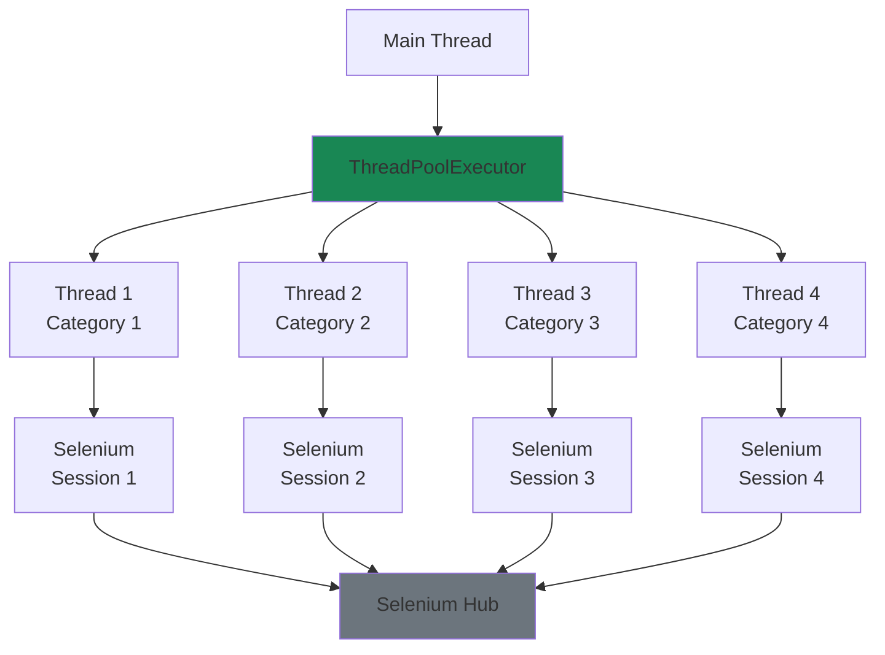
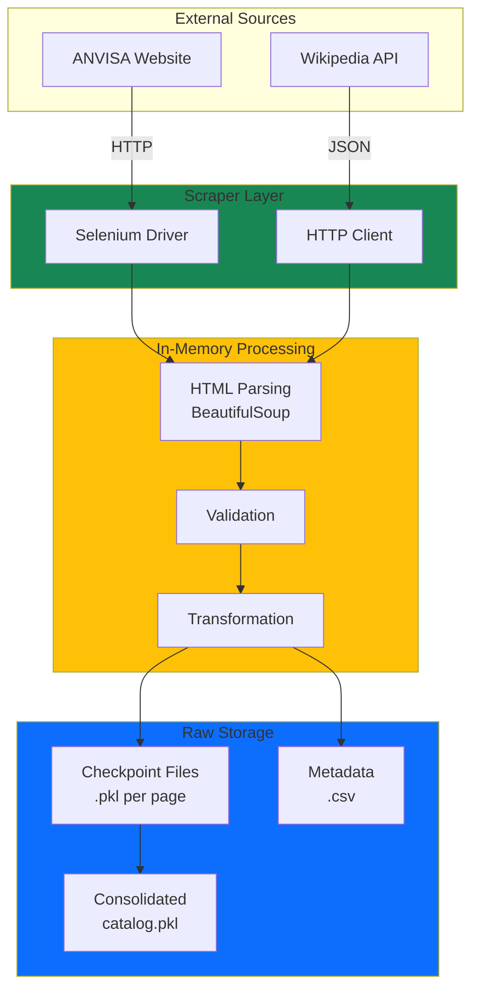

# Scrapers

The scraper module handles all data acquisition tasks, extracting pharmaceutical information from regulatory agencies, medical databases, and public sources.

---

## 🎯 Overview

Scrapers are the entry point of the DrugsLM data pipeline, responsible for:

- **Discovery**: Finding available drugs and their metadata
- **Extraction**: Downloading package inserts (PDFs) and structured data
- **Validation**: Ensuring data completeness and consistency
- **Persistence**: Storing raw data with proper checkpointing



---

## 📦 Available Scrapers

### [ANVISA Scraper](anvisa/)

**Status**: 🟢 Active Development

Extracts drug information from Brazil's National Health Surveillance Agency (ANVISA).

**Key Components**:
- **[Catalog Builder](anvisa/catalog/)**: Lists all registered drugs with metadata
- **[Leaflets Downloader](anvisa/leaflets/)** *(planned)*: Downloads PDF package inserts
- **[Pipelines](anvisa/pipelines/)** *(planned)*: Dagster integration for orchestration
- **[Configuration](anvisa/config/)**: ANVISA-specific settings and constants

**Data Collected**:
- Drug name and registration number (`expediente`)
- Manufacturer information
- Publication dates
- URLs for detailed pages and PDFs
- Regulatory category classification

**Quick Start**:
```bash
# Fetch metadata from all categories
uv run python -m drugslm.scraper.anvisa.catalog run --fetch-only

# Run full catalog scraper (4 parallel threads)
uv run python -m drugslm.scraper.anvisa.catalog run --threads 4

# Check data consistency
uv run python -m drugslm.scraper.anvisa.catalog run --check
```

---

### Wikipedia Scraper *(Planned)*

**Status**: ⚪ Not yet implemented

Will extract drug information from Wikipedia's medical database.

**Planned Features**:
- API-based extraction (no browser automation)
- Multilingual support (PT, EN, ES)
- Category-based discovery
- Infobox parsing for structured data

**Target Data**:
- Drug classifications
- Chemical structures
- Usage indications
- Side effects and interactions

---

### [Selenium Infrastructure](selenium/)

**Status**: 🟢 Implemented

Shared utilities for browser automation used by all web-based scrapers.

**Key Features**:
- Remote Selenium Hub connection management
- Context managers for safe driver lifecycle
- Retry logic for transient failures
- Browser configuration loading from YAML
- Visual debugging helpers (highlight, scroll)

**Usage**:
```python
from drugslm.scraper.selenium import webdriver_manager, get_firefox_options

options = get_firefox_options()

with webdriver_manager(options) as driver:
    driver.get("https://example.com")
    # Your scraping logic here
```

---

## 🏗️ Architecture Patterns

### Resumability

All scrapers implement checkpoint-based resumability:



**Benefits**:
- Survives network failures
- Can be paused and resumed
- No duplicate work on retries
- Progress visible during execution

---

### Parallel Execution

Scrapers support thread-based parallelism:

```python
# Sequential (1 thread, safest)
scrap_categories(n_threads=1)

# Parallel (4 threads, 4x faster)
scrap_categories(n_threads=4)

# Maximum (12 threads, category count limit)
scrap_categories(n_threads=12)
```

**Architecture**:



---

## 📊 Data Flow

### From Source to Storage



---

## 🛡️ Error Handling

### Retry Strategies

Scrapers implement multi-level retry logic:

```python
from retry import retry

@retry(tries=3, delay=2, backoff=2)
def fetch_page(driver: WebDriver, url: str):
    """Retries up to 3 times with exponential backoff."""
    driver.get(url)
    return driver.page_source
```

**Retry Levels**:
1. **Network requests**: 3 attempts with exponential backoff
2. **Element finding**: 5 second wait with implicit retries
3. **Session creation**: 3 attempts to connect to Selenium Hub
4. **Category scraping**: Isolated per category (failure doesn't crash others)

### Fault Isolation

Each category scrapes independently:

```python
# If Category 3 fails, others continue unaffected
with ThreadPoolExecutor(max_workers=4) as executor:
    for category_id in [1, 2, 3, 4]:
        executor.submit(scrap_unit_category, category_id)
```

---

## 📈 Progress Tracking

### Real-time Monitoring

Scrapers log progress to `scrap_progress.csv`:

```csv
timestamp,category_id,current_page,last_page,saved_size
20231027103045,1,5,25,50
20231027103102,1,6,25,50
20231027103118,2,1,10,50
```

**Usage**:
```bash
# Watch progress in real-time
tail -f data/raw/anvisa/index/scrap_progress.csv

# Count completed pages
wc -l data/raw/anvisa/index/scrap_progress.csv
```

### Validation

Compare local data against remote metadata:

```bash
uv run python -m drugslm.scraper.anvisa.catalog run --check
```

**Output**:
```
--- Index Consistency Report ---
Expected (Remote) :     8245
Found    (Local)  :     8245
Difference        :        0
--------------------------------
✓ Local catalog is complete.
```

---

## 🔧 Configuration

### Global Settings

Scrapers read from `drugslm/config.py`:

```python
# Selenium Hub URL
HUB_URL = os.getenv("HUB_URL", "http://localhost:4444/wd/hub")

# Data directories
DATA_DIR = PROJECT_ROOT / "data"
RAW_DATA_DIR = DATA_DIR / "raw"
```

### Scraper-Specific Config

Each scraper has its own `config.py`:

```python
# drugslm/scraper/anvisa/config.py
CATEGORIES_URL = "https://consultas.anvisa.gov.br/#/bulario/q/?categoriasRegulatorias=%s"
CATEGORIES = [1, 2, 3, 4, 5, 6, 7, 8, 9, 10, 11, 12]
```

---

## 🧪 Testing Scrapers

### Unit Tests

Test individual functions in isolation:

```python
def test_table_parsing():
    """Test HTML table extraction."""
    html = "<table><tr><td>Drug Name</td></tr></table>"
    element = create_mock_element(html)
    
    data = table2data(element)
    
    assert len(data) == 1
    assert data[0][0] == "Drug Name"
```

### Integration Tests

Test full scraper execution with mocked Selenium:

```python
@pytest.fixture
def mock_driver():
    """Provides a mocked WebDriver for testing."""
    driver = Mock(spec=WebDriver)
    driver.session_id = "test-session-123"
    return driver

def test_scrap_single_page(mock_driver):
    """Test scraping a single page."""
    # Setup mock responses
    mock_driver.find_element.return_value = create_mock_table()
    
    # Execute scraper
    data = scrap_pages(mock_driver, category_id=1)
    
    # Verify results
    assert len(data) > 0
```

---

## 📚 API Documentation

Detailed API documentation for each scraper module:

- **[ANVISA Catalog](anvisa/catalog/)**: Complete API reference for catalog scraper
- **[ANVISA Configuration](anvisa/config/)**: Constants and settings
- **[Selenium Utils](selenium/)**: Browser automation helpers

---

## 🚀 Performance Optimization

### Current Bottlenecks

1. **Network I/O**: Waiting for page loads (1-3 seconds per page)
2. **Selenium Overhead**: Browser startup (~5 seconds per session)
3. **Sequential Pagination**: Must navigate page-by-page

### Optimization Strategies

**Implemented**:
- ✅ Thread pool for parallel category processing
- ✅ Checkpoint-based resumability (no duplicate work)
- ✅ Remote Selenium Hub (reduces local resource usage)

**Planned**:
- ⚪ Connection pooling for HTTP requests
- ⚪ Headless browser mode (faster rendering)
- ⚪ Async I/O for non-browser operations

---

## 🔗 Related Documentation

- [Architecture: Scraper Design](../../architecture/#scraper-design)
- [Infrastructure: Selenium Grid Setup](../../infrastructure/#selenium-grid-setup)
- [Getting Started: Running Your First Scraper](../../getting-started/#running-your-first-scraper)

---

**Next**: Explore the [ANVISA Scraper](anvisa/) for the primary data source implementation.