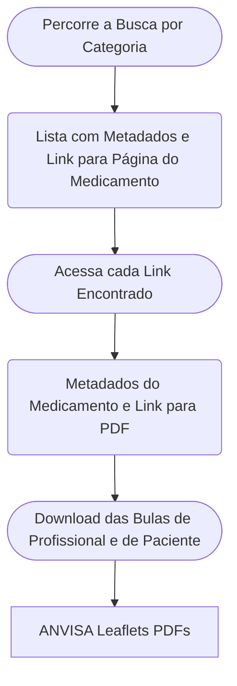

# ANVISA Scraper

The ANVISA ([Agência Nacional de Vigilância Sanitária]) scraper extracts drug registration data and package inserts from Brazil's national health regulatory agency.

```mermaid

flowchart TD

A([Percorre a Busca por Categoria])
B(Lista com Metadados e Link para Página do Medicamento)
C([Acessa cada Link Encontrado])
D(Metadados do Medicamento e Link para PDF)
E([Download das Bulas de Profissional e de Paciente])
F[ANVISA Leaflets PDFs]

A --> B --> C --> D --> E --> F

click F "/architecture/roadmap/#data-acquisition-and-preparation-etl" "Go to Data Acquisition and Preparation (ETL) Diagram"


```
